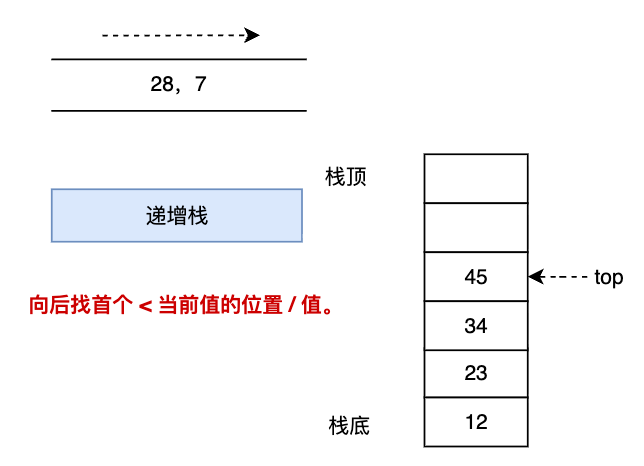
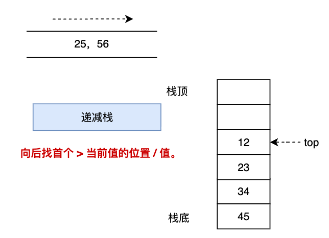

# CSP-S 提高组
## 常见优化技巧
### 单调栈

---

## 单调栈概述

### 基本概念

**单调栈**：栈内元素保持单调性的数据结构

**单调性**：
- 单调递增栈：栈内元素从栈底到栈顶递增
- 单调递减栈：栈内元素从栈底到栈顶递减

**核心思想**：及时排除不可能的选项，保持策略集合的有效性和秩序性

**时间复杂度**：每个元素入栈出栈各一次，$O(n)$

---

## 单调栈解决的问题

### 典型应用场景

1. **下一个更大元素**（Next Greater Element）
2. **柱状图中最大矩形**（Largest Rectangle in Histogram）
3. **接雨水问题**（Trapping Rain Water）
4. **滑动窗口最值**
5. **维护单调性**的相关问题

---



### 单调递增栈

适用场景：每个位置都向后找首个小于当前元素的位置。

右边样例中，我们看到**栈内(从下而上)保持单调递增**，原因是栈内所有元素向后(上)看都找不到小于当前值的位置。

---


### 单调递增栈

条件 1：如果当前元素大于等于栈顶元素，则直接入栈

```cpp
for(int i=1;i<=n;i++)
    if (a[i] >= a[stk[top]]):
        stk[++top] = i;
```

> 注：单调栈/队列内寄存是下标，也可以存储原值本身。

---


### 单调递增栈

条件 2：循环判定：如果当前元素小于栈顶元素，满足：说明首个小于栈顶元素即为当前元素。

```cpp
for(int i=1;i<=n;i++)
    while( top && a[i] < a[stk[top]] )
        ans[stk[top++]] = i;
```

如例子，当前元素为 7，先不入栈判断与栈顶元素的关系，发现 7 小于 `45、34、23、12`，则循环弹出这 4 个栈内元素，并在弹出的过程中记录答案（首个小于 `45、34、23、12` 的元素为 7，7 的下标为 5）。

---

### 递增栈的模板代码
```cpp
int a[N],stk[N];      // 原值数组，栈数组
int top = 0;      // 栈顶指针

// 单调递增栈：求每个元素右边第一个比它小的元素
for(int i=1;i<=n;i++)
{
    // 当栈不为空且当前元素小于栈顶元素时
    while( top && a[i] < a[stk[top]] )
        ans[stk[top++]]=i;  // 记录结果：右边第一个小于的元素位置
        // 肯定以后同学有疑问，条件 1 去哪里，可以想想。
    stk[++top] = i;
}
```

<p class="little red">答：当前元素为 a[i] 已经被前面的元素所看见并记录了，它本身只需要入栈等待后续的响应即可。
</p>

---

## 单调递减栈

适合场景：每个位置都向后找**首个大于当前元素的位置**。

右边样例中，我们看到**栈内(从下而上)保持单调递减**，原因是栈内所有元素向后(上)看都找不到大于当前值的位置。




---


### 单调递减栈

循环判定：如果当前元素大于栈顶元素，满足：说明首个大于栈顶元素即为当前元素。

```cpp
for(int i=1;i<=n;i++)
    while( top && a[i] > a[stk[top]] )
        ans[stk[top++]] = i;
```

如例子，当前元素为 56，先不入栈判断与栈顶元素的关系，发现 56 大于 `45、34、23、12`，则循环弹出这 4 个栈内元素，并在弹出的过程中记录答案（首个大于 `45、34、23、12` 的元素为 56, 56 的下标为 5）。

---

### 单调递减栈的模板代码
```cpp
int a[N],stk[N];      // 原值数组，栈数组
int top = 0;          // 栈顶指针

// 单调递减栈：求每个元素右边第一个比它大的元素
for(int i=1;i<=n;i++)
{
    // 当栈不为空且当前元素大于栈顶元素时
    while( top && a[i] > a[stk[top]] )
        ans[stk[top++]]=i;  // 记录结果：右边第一个大于的元素位置
    stk[++top] = i;
}
```

---

### 单调递减栈示例

**问题**：找到数组中每个元素右边第一个比它大的元素

**输入**：`[2, 1, 4, 3, 5]`

**输出**：`[2, 2, 4, 4, -1]`（索引位置）

**过程分析**：
- 元素 `2`：入栈
- 元素 `1`：入栈（`1 < 2`，保持递增）
- 元素 `4`：弹出 `1`（`4 > 1`），弹出 `2`（`4 > 2`），入栈 `4`
- 元素 `3`：入栈（`3 < 4`）
- 元素 `5`：弹出 `3`（`5 > 3`），弹出 `4`（`5 > 4`），入栈 `5`

---

### 单调递增栈应用

**问题**：找到数组中每个元素右边第一个比它小的元素

**输入**：`[3, 4, 2, 7, 5]`

**输出**：`[2, 2, -1, 4, -1]`（索引位置）

**应用场景**：
- 求解最小值的相关问题
- 某些动态规划的优化
- 区间最小值的维护

---

# P5788 【模板】单调栈

#### ▍题意

给出项数为 $n$ 的整数数列 $a_{1 \dots n}$。

定义函数 $f(i)$ 代表数列中第 $i$ 个元素之后第一个大于 $a_i$ 的元素的**下标**，即 $f(i)=\min_{i<j\leq n, a_j > a_i} \{j\}$。若不存在，则 $f(i)=0$。

试求出 $f(1\dots n)$。

对于 $100\%$ 的数据，$1 \le n\leq 3\times 10^6$，$1\leq a_i\leq 10^9$。

---

**▍分析**

模板题，寻找每个位置向后首个大于当前元素的下标，**单调递减栈**。

**时间复杂度**：每个元素最多入栈、出栈一次，故为 $O(n)$。

---

**▍参考代码**

```cpp
const int N = 3e6 + 10;
int n;
int a[N], stk[N], h[N];

int main()
{
    ios::sync_with_stdio(false), cin.tie(nullptr);
    cin >> n;
    for (int i = 1; i <= n; i++)
        cin >> a[i];
    int tt = 0;
    for (int i = 1; i <= n; i++)
    {
        // 当前 i 大于栈顶元素 stk[tt] 则弹出，并记录里 stk[tt] 最近且比它大的为止
        while (tt && a[i] > a[stk[tt]]) 
            h[stk[tt]] = i, tt--;
        stk[++tt] = i;
    }
    for (int i = 1; i <= n; i++)
        cout << h[i] << " ";
    return 0;
}
```

---

### P1901 发射站

#### ▍题意

  有 $N$ 个能量发射站排成一行，每个发射站 $i$ 有高度 $H_i$ 和能量值 $V_i$。每个发射站向两边发射能量，但能量只能被两边**最近的且比它高**的发射站接收。求接收能量最多的发射站接收的能量值。

  数据范围：$1 \leq N \leq 10^6$，$1 \leq H_i \leq 2 \times 10^9$，$1 \leq V_i \leq 10^4$。

---

#### ▍分析

  本题需要找到每个发射站左右两边第一个比它高的发射站，并将能量传递给它们。可以使用**单调栈**来高效解决：

  - 维护一个**单调递减栈**（栈底到栈顶高度递减）
  - 遍历时，如果当前发射站高度大于栈顶发射站高度，说明栈顶发射站的**右边第一个更高**的发射站就是当前发射站
  - 同时，栈中前一个元素就是当前发射站的**左边第一个更高**的发射站
  - 在出栈和入栈过程中累加能量值

  时间复杂度：$O(N)$，每个发射站入栈出栈各一次。

---

#### ▍参考代码

```cpp
const int N = 1e6 + 10, MAXN = 0x3f3f3f3f;
int n, H[N], V[N], sum[N];
int top, st[N]; // 单调递减栈：存储发射站下标
int main()
{
    cin >> n;
```
---

```cpp
    for (int i = 1; i <= n; i++)
    {
        cin >> H[i] >> V[i];
        
        // 当前发射站高度大于栈顶发射站高度
        while (top && H[st[top]] < H[i])
        {
            // 栈顶发射站的右边第一个更高发射站是当前发射站
            // 当前发射站接收栈顶发射站的能量
            sum[i] += V[st[top]];
            top--;
        }
        
        // 如果栈不为空，当前发射站的左边第一个更高发射站是栈顶
        // 栈顶发射站接收当前发射站的能量
        if (top) 
            sum[st[top]] += V[i];
            
        // 当前发射站入栈
        st[++top] = i;
    }
    
    // 找出接收能量最多的发射站
    int ans = 0;
    for (int i = 1; i <= n; i++)
        ans = max(ans, sum[i]);

    cout << ans << endl;
    return 0;
}
```

---

### P1950 长方形

#### ▍题意

  给定一个 $n \times m$ 的网格，有些格子被标记（用 `*` 表示），有些格子是空白（用 `.` 表示）。要求统计所有不包含任何标记格子的长方形数量。长方形只能沿着网格线裁剪。

  数据范围：$1 \leq n, m \leq 1000$。

---

#### ▍分析

  本题可以采用**单调栈**结合**组合数学**的思路解决，其核心思想基于组合数学中的**计数原理**：

  - 定义 $h[i][j]$ 表示从第 $i$ 行第 $j$ 列向上最多能延伸的连续空白格子数
  - 对于每一行，使用单调栈求出每个位置 $j$ 的左右边界：
    - $l[j]$：左边第一个高度小于 $h[i][j]$ 的位置
    - $r[j]$：右边第一个高度小于等于 $h[i][j]$ 的位置
  - 对于每个位置 $(i,j)$，以 $h[i][j]$ 为高的长方形数量为：$(j - l[j]) \times (r[j] - j) \times h[i][j]$

---

  **组合数学原理**：

  1. **高度确定**：$h[i][j]$ 表示以 $(i,j)$ 为底边的矩形能向上延伸的最大高度
  2. **宽度组合**：
     - 左边界有 $(j - l[j])$ 种选择（从 $l[j]+1$ 到 $j$）
     - 右边界有 $(r[j] - j)$ 种选择（从 $j$ 到 $r[j]-1$）
     - 根据**乘法原理**，底边宽度组合数为 $(j - l[j]) \times (r[j] - j)$
  3. **高度组合**：对于每个固定的底边宽度，高度可以是 $1$ 到 $h[i][j]$ 的任意值，因此有 $h[i][j]$ 种选择
  4. **总方案数**：根据乘法原理，总方案数为宽度组合数与高度组合数的乘积

  这样计算确保了每个矩形被**恰好计数一次**，不会重复也不会遗漏。

  时间复杂度：$O(n \times m)$，每行处理一次单调栈。

---

#### ▍参考代码

```cpp
const int N = 1010;
int n, m;
char a[N][N];
int h[N][N];    // h[i][j]: 从(i,j)向上连续的空白格子数
int l[N], r[N]; // 左右边界
int st[N], top; // 单调栈
long long ans;
// work() ...
int main() {
    cin >> n >> m;
    for (int i = 1; i <= n; i++) 
        scanf("%s", a[i] + 1);
    
    // 预处理高度数组
    for (int i = 1; i <= n; i++)
        for (int j = 1; j <= m; j++) 
            if (a[i][j] == '*') 
                h[i][j] = 0;
            else 
                h[i][j] = h[i - 1][j] + 1;
    
    // 对每一行处理
    for (int i = 1; i <= n; i++) 
        work(i);
    
    cout << ans << endl;
    return 0;
}
```

---

```cpp
void work(int row) {
    top = 0;
    // 计算右边界：右边第一个高度小于等于当前高度的位置
    for (int i = 1; i <= m; i++) {
        while (top && h[row][st[top]] >= h[row][i]) 
            r[st[top--]] = i;
        st[++top] = i;
    }
    while (top) r[st[top--]] = m + 1;
    
    // 计算左边界：左边第一个高度小于当前高度的位置
    for (int i = m; i >= 1; i--) {
        while (top && h[row][st[top]] > h[row][i]) 
            l[st[top--]] = i;
        st[++top] = i;
    }
    while (top) l[st[top--]] = 0;
    
    // 计算当前行的贡献
    for (int j = 1; j <= m; j++) 
        // 组合数学：左边界选择数 × 右边界选择数 × 高度选择数
        ans += (long long)(j - l[j]) * (r[j] - j) * h[row][j];
}
```


---

### B3666 求数列所有后缀最大值的位置

#### ▍题意

  有一个初始为空的数列 $a$，进行 $n$ 次操作，每次在末尾添加一个正整数 $x$。每次操作后，需要找到当前数列的所有**后缀最大值**的下标（下标从 1 开始），并输出这些下标的**按位异或和**。

  一个下标 $i$ 是后缀最大值当且仅当：对于所有 $i < j \leq |a|$，都有 $a_i > a_j$。

  数据范围：$1 \leq n \leq 10^6$，$1 \leq x_i < 2^{64}$。

---

## 样例解释

当前元素，栈内元素，栈内存储下标，异或和结果

`2, [2], [1], 1 `
`1, [2,1], [1,2], 1^2=3 `
`3, [3], [3], 3 `
`5, [5], [4], 4 `
`4, [5,4], [4,5], 4^5=1`

---

#### ▍分析

  本题需要使用**单调栈**来维护后缀最大值：

  - 维护一个**单调递减栈**，栈中存储的是当前的后缀最大值位置
  - 栈中元素对应的数值从栈底到栈顶递减
  - 每次添加新元素时：
    - 弹出栈顶所有小于等于当前值的元素（这些位置不再是后缀最大值）
    - 将当前位置入栈
  - 用变量 $ans$ 维护当前栈中所有位置的异或和

---

  **单调栈**：

  - 栈中存储的是"潜在"的后缀最大值位置
  - 当新元素加入时，比它小的元素都会被"淘汰"
  - 栈的单调性保证了高效维护

  **异和维护**：

  - 弹出元素时：$ans = ans \oplus pop\_element$（异或抵消）
  - 加入元素时：$ans = ans \oplus new\_element$

  时间复杂度：$O(n)$，每个元素入栈出栈各一次。

---

#### ▍参考代码

```cpp
#define ull unsigned long long
const int N = 1e6 + 10;
ull a[N];
int stk[N], top; // 单调栈存储位置索引

int main()
{
    int n;
    cin >> n;
    for (int i = 1; i <= n; i++)
        cin >> a[i];
    
    int ans = 0; // 维护当前后缀最大值位置的异或和
    
    for (int i = 1; i <= n; i++) {
        // 弹出所有小于等于当前值的栈顶元素
        // 这些位置不再是后缀最大值
        while (top && a[i] >= a[stk[top]]) {
            ans ^= stk[top]; // 异或抵消弹出的位置
            top--;
        }
        
        // 当前位置入栈
        stk[++top] = i;
        ans ^= i; // 异或加入的位置
        
        cout << ans << "\n";
    }

    return 0;
}
```
---

### P4147 玉蟾宫

#### ▍题意

给定一个 $N \times M$ 的网格，每个格子是 'F' 或 'R'。要求找到最大的全 'F' 矩形区域，输出该矩形面积的 $3$ 倍。

数据范围：$1 \leq N, M \leq 1000$。

> 样例解释：在 $5 \times 6$ 的网格中，最大全 'F' 矩形的面积为 $15$，所以输出 $3 \times 15 = 45$。

---

#### ▍分析

**核心思路**：将问题转化为柱状图中最大矩形面积问题，使用单调栈优化。

1. **预处理高度数组**：
    - 对于每个位置 $(i,j)$，计算从该位置向上连续的 'F' 数量
    - 如果当前格子是 'F'，则 `height[i][j] = height[i-1][j] + 1`，否则为 $0$

2. **逐行处理**：
    - 对每一行，将其视为柱状图的底部
    - 使用单调递增栈计算该行上方的最大矩形面积
---

3. **单调栈**：
    - 栈中存储 `(height, width)` 对，表示高度和对应的可控宽度
    - 遍历每一列时维护栈的单调递增性
    - 弹出元素时计算可能的矩形面积并更新最大值

**时间复杂度**：$O(N \times M)$，每个元素入栈出栈各一次。

---

#### ▍参考代码

```cpp
const int N = 1010;

struct Node {
    int height;  // 柱状图高度
    int width;   // 该高度对应的可控宽度
} stack[N];
int n, m;
int height[N][N];  // height[i][j] 表示从(i,j)向上连续的'F'数量
char grid[N][N];
```
---


```cpp
// 计算第row行及以上的最大矩形面积
int calculate(int row) {
    int top = 0;      // 栈顶指针
    int max_area = 0; // 当前行的最大面积
    
    // 初始化栈，加入一个高度为0的哨兵
    stack[++top].height = 0, stack[top].width = 0;
    
    for (int col = 1; col <= m; ++col) {
        int current_height = height[row][col];
        int temp_width = 0;
        
        // 维护单调递增栈：弹出所有高度 >= 当前高度的元素
        while (top > 0 && stack[top].height >= current_height) {
            temp_width += stack[top].width;  // 累加被弹出元素的宽度
            // 计算以被弹出元素为高的矩形面积
            max_area = max(max_area, stack[top].height * temp_width);
            top--;
        }
        
        // 当前元素入栈
        stack[++top].height = current_height;
        stack[top].width = temp_width + 1;  // 当前元素宽度 = 弹出元素总宽度 + 1
    }
    
    // 处理栈中剩余元素
    int remaining_width = 0;
    while (top > 0) {
        remaining_width += stack[top].width;
        max_area = max(max_area, stack[top].height * remaining_width);
        top--;
    }
    
    return max_area;
}
```
---

```cpp
int main() {
    // 读入网格尺寸
    cin >> n >> m;
    
    // 读入网格并预处理高度数组
    for (int i = 1; i <= n; ++i) 
        for (int j = 1; j <= m; ++j) {
            cin >> grid[i][j];
            if (grid[i][j] == 'F') 
                // 如果是'F'，高度为上一行高度+1
                height[i][j] = height[i - 1][j] + 1;
            else 
                // 如果是'R'，高度重置为0
                height[i][j] = 0;
        }
    
    int max_rectangle = 0;
    // 对每一行计算最大矩形面积
    for (int row = 1; row <= n; ++row) 
        max_rectangle = max(max_rectangle, calculate(row));
    
    // 输出3倍的最大面积
    cout << max_rectangle * 3 << endl;
    
    return 0;
}
```

---

**小结**：

1. **预处理阶段**：`height[i][j]` 存储从当前位置向上连续的 'F' 数量，形成柱状图的高度数组。

2. **单调栈**：
    - 栈中存储 `(height, width)` 对，`width` 表示该高度能向左延伸的宽度
    - 当遇到较小高度时，弹出栈顶元素并计算面积
    - 被弹出元素的宽度会累加到新元素的宽度中

3. **边界处理**：在栈底放置高度为 $0$ 的哨兵，避免空栈判断。

4. **复杂度分析**：每个元素最多入栈出栈一次，总时间复杂度 $O(N \times M)$。

这种方法将二维问题转化为一维的柱状图最大矩形问题，通过单调栈高效求解。


---

# 单调栈总结

---

## 单调栈模板总结

```cpp
int a[N],stk[N];      // 原值数组，栈数组
int top = 0;          // 栈顶指针
// 单调递增栈：求每个元素右边第一个比它小的元素
for(int i=1;i<=n;i++)
{
    // 当栈不为空且当前元素小于栈顶元素时
    while( top && a[i] < a[stk[top]] )
        ans[stk[top++]]=i;  // 记录结果：右边第一个小于的元素位置
    stk[++top] = i;
}

// 单调递减栈：求每个元素右边第一个比它大的元素
for(int i=1;i<=n;i++)
{
    // 当栈不为空且当前元素大于栈顶元素时
    while( top && a[i] > a[stk[top]] )
        ans[stk[top++]]=i;  // 记录结果：右边第一个大于的元素位置
    stk[++top] = i;
}

```

---

## 时间复杂度分析

### 性能特点

- **每个元素**：入栈一次，出栈最多一次
- **总操作次数**：$2n$ 次
- **时间复杂度**：$O(n)$
- **空间复杂度**：$O(n)$
---

## 使用技巧与注意事项

### 技巧

1. **边界处理**：在数组前后`添加哨兵`元素简化判断
2. **栈存储内容**：可以存储索引或值，根据需求选择
3. **单调性选择**：根据问题需求选择递增栈或递减栈
4. **结果记录**：在出栈时记录结果，充分利用信息

### 常见错误

1. **忘记处理栈中剩余元素**
2. **边界条件判断错误**
3. **单调性方向搞反**
4. **数组越界访问**

---

## 练习题推荐

- P5788 【模板】单调栈：单调递减栈。
- P1901 发射站：两个单调递减栈。
- P1950 长方形：网格、组合数学、单调栈。
- P4147 玉蟾宫：二维转一维。
- P2866 [USACO06NOV] Bad Hair Day S：单调递减栈。
- B3666 求数列所有后缀最大值的位置：单调递减栈，后缀最大/最小值、非严格最大/最小理念。


---

## 复习要点

1. **理解单调栈的核心思想**：及时排除无效选项
2. **掌握两种单调栈**：递增栈和递减栈的应用场景
3. **注意边界处理**：哨兵技巧的使用
4. **分析时间复杂度**：理解 $O(n)$ 的由来

**掌握单调栈，高效解决区间最值问题！**