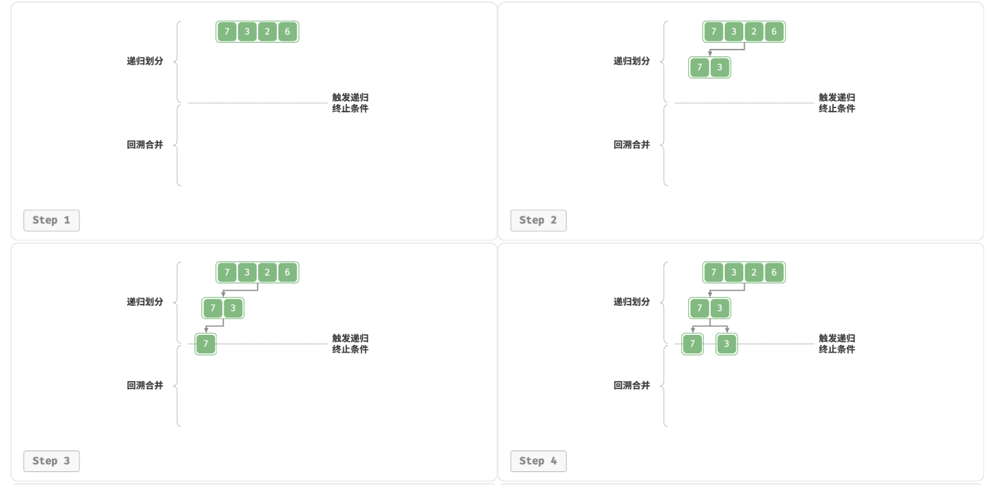
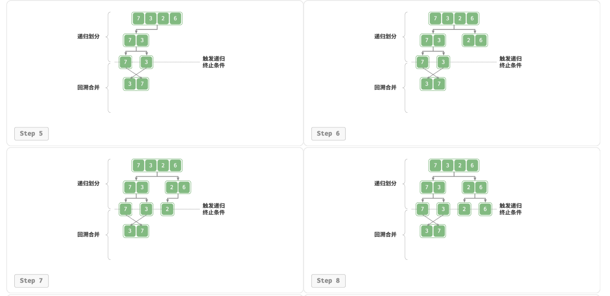
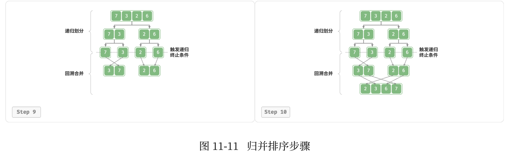

# 信息学竞赛 - 提高组
## 分治与倍增算法
### 归并排序与快速幂

---

### 本章内容
1. **归并排序**原理与实现
2. **逆序对**问题求解
3. **快速幂**算法原理
4. **麦森数**计算
5. **火柴排队**问题

### 目标
- 掌握**分治思想**在排序中的应用
- 理解倍增思想在**幂运算**中的优化
- 能够应用这些算法解决实际问题

---

## 归并排序

### 基本思想

**分治策略**（Divide and Conquer）：
1. **分解**：将待排序序列分成两个子序列
2. **解决**：递归地对子序列进行排序
3. **合并**：将两个有序子序列合并成一个有序序列

**时间复杂度**：
- 最优：$O(n \log n)$
- 最差：$O(n \log n)$  
- 平均：$O(n \log n)$

**空间复杂度**：$O(n)$

---



---



---



---

## 归并排序原理

### 分治过程推导

设待排序数组为 $arr[0 \dots n-1]$

1. **分解**：
   - 计算中点 $mid = \lfloor \frac{0 + (n-1)}{2} \rfloor$
   - 左子数组：$arr[0 \dots mid]$
   - 右子数组：$arr[mid+1 \dots n-1]$

2. **递归排序**：
   - $mergeSort(arr, 0, mid)$
   - $mergeSort(arr, mid+1, n-1)$

3. **合并**：
   - 比较两个有序子数组的元素
   - 按顺序放入临时数组
   - 将临时数组复制回原数组

---

## 归并排序代码实现

```cpp
const int N = 100010;
int a[N], temp[N];

void mergeSort(int l, int r) {
    if (l >= r) return;
    
    int mid = (l + r) >> 1;
    mergeSort(l, mid);
    mergeSort(mid + 1, r);
    
    // 合并两个有序子数组
    int k = 0, i = l, j = mid + 1;
    while (i <= mid && j <= r) {
        if (a[i] <= a[j]) temp[k++] = a[i++];
        else temp[k++] = a[j++];
    }
    
    // 处理剩余元素
    while (i <= mid) temp[k++] = a[i++];
    while (j <= r) temp[k++] = a[j++];
    
    // 复制回原数组
    for (i = l, j = 0; i <= r; i++, j++) 
        a[i] = temp[j];
}
```

---

## 逆序对问题

### P1908 逆序对

#### 题目描述
给定一个序列 $a_1, a_2, \dots, a_n$，求逆序对的数量。

**逆序对**：如果 $i < j$ 且 $a_i > a_j$，则 $(a_i, a_j)$ 是一个逆序对。

**数据范围**：$1 \leq n \leq 5 \times 10^5$，$|a_i| \leq 10^9$

---

### 逆序对求解思路

#### 暴力解法（不可行）
枚举所有 $i < j$ 的组合，检查是否 $a_i > a_j$  
时间复杂度：$O(n^2)$，对于 $n = 5 \times 10^5$ 会超时

#### 归并排序优化
在归并排序的合并过程中统计逆序对数量：


---


**关键观察**：
- 当 $a[i] > a[j]$ 时，$a[i]$ 及 $a[i]$ 之后的所有元素都与 $a[j]$ 构成逆序对
- 逆序对数量增加：$mid - i + 1$

**时间复杂度**：$O(n \log n)$

---

### 逆序对代码实现

```cpp
long long mergeSortAndCount(int l, int r) {
    if (l >= r) return 0;
    
    int mid = (l + r) >> 1;
    long long res = mergeSortAndCount(l, mid) + mergeSortAndCount(mid + 1, r);
    
    int k = 0, i = l, j = mid + 1;
    while (i <= mid && j <= r) {
        if (a[i] <= a[j]) {
            temp[k++] = a[i++];
        } else {
            // 当a[i] > a[j]时，统计逆序对
            res += mid - i + 1;
            temp[k++] = a[j++];
        }
    }
    
    while (i <= mid) temp[k++] = a[i++];
    while (j <= r) temp[k++] = a[j++];
    
    for (i = l, j = 0; i <= r; i++, j++) 
        a[i] = temp[j];
    
    return res;
}
```

---

## 快速幂算法

### 问题背景
计算 $a^b \mod m$，其中 $a, b, m$ 都是整数

**暴力解法**：循环 $b$ 次乘法，时间复杂度 $O(b)$  
当 $b$ 很大时（如 $b = 10^9$），暴力方法不可行

---

### 快速幂思想
**倍增思想**：利用二进制分解指数

**数学原理**：
- $a^b = a^{b_0 \cdot 2^0 + b_1 \cdot 2^1 + \dots + b_k \cdot 2^k}$
- $a^b = a^{b_0 \cdot 2^0} \times a^{b_1 \cdot 2^1} \times \dots \times a^{b_k \cdot 2^k}$

其中 $b_i$ 是 $b$ 的二进制表示的第 $i$ 位

---

## 快速幂推导过程

### 二进制分解

设 $b = (b_k b_{k-1} \dots b_1 b_0)_2$，其中 $b_i \in \{0, 1\}$

则：
$$a^b = a^{\sum_{i=0}^k b_i \cdot 2^i} = \prod_{i=0}^k a^{b_i \cdot 2^i}$$

---

**计算策略**：
1. 从低位到高位处理 $b$ 的二进制位
2. 维护当前位的权重 $base = a^{2^i}$
3. 如果当前位为 1，将结果乘以 $base$

**时间复杂度**：$O(\log b)$

---

## 快速幂代码实现

```cpp
// 计算 a^b % mod
long long fastPow(long long a, long long b, long long mod) {
    long long res = 1;
    while (b > 0) {
        // 如果当前二进制位为1，乘上对应的a^(2^k)
        if (b & 1) {
            res = res * a % mod;
        }
        // a倍增：a^(2^k) -> a^(2^(k+1))
        a = a * a % mod;
        // 处理下一位
        b >>= 1;
    }
    return res;
}
```

---

## P1226 【模板】快速幂

### 题目描述
给定三个整数 $a, b, p$，求 $a^b \bmod p$ 的值。

**数据范围**：
- $1 \leq a, b, p \leq 10^9$

---

### 参考代码
```cpp
int main() {
    long long a, b, p;
    cin >> a >> b >> p;
    
    long long res = 1;
    while (b) {
        if (b & 1) res = res * a % p;
        a = a * a % p;
        b >>= 1;
    }
    
    cout << res % p << endl;
    return 0;
}
```

---

## P1045 麦森数

### 题目描述
形如 $2^P - 1$ 的素数称为麦森数。计算 $2^P - 1$ 的位数和最后 $500$ 位数字。

**数据范围**：$1000 \leq P \leq 3100000$

---

### 麦森数求解思路

#### 1. 计算位数
根据对数性质：
- $2^P - 1$ 的位数等于 $\lfloor P \cdot \log_{10} 2 \rfloor + 1$

#### 2. 计算后500位
- 使用高精度乘法 + 快速幂
- 只保留后500位数字
- 注意减1时的借位处理

---

**关键技巧**：
- 高精度数组存储大数
- 快速幂优化计算过程
- 只维护必要的位数以减少计算量

---

### 麦森数代码实现

```cpp
const int LEN = 500; // 只计算500位

// 高精度乘法（只保留后LEN位）
void multiply(int a[], int b[]) {
    int temp[LEN * 2] = {0};
    for (int i = 0; i < LEN; i++) 
        for (int j = 0; j < LEN; j++) 
            if (i + j < LEN * 2)
                temp[i + j] += a[i] * b[j];
    
    // 处理进位
    for (int i = 0; i < LEN; i++) {
        if (i + 1 < LEN * 2) temp[i + 1] += temp[i] / 10;
        a[i] = temp[i] % 10;
    }
}
```
---

```cpp
int main() {
    int p;
    cin >> p;
    
    // 计算位数
    int digits = (int)(p * log10(2)) + 1;
    cout << digits << endl;
    
    // 快速幂计算2^p
    int base[LEN] = {0}, res[LEN] = {0};
    base[0] = 2, res[0] = 1;   // 初始化为2 , 初始化为1
    
    while (p > 0) {
        if (p & 1) multiply(res, base);
        multiply(base, base);
        p >>= 1;
    }
    
    // 减1处理
    res[0] -= 1;
    for (int i = 0; i < LEN; i++) 
        if (res[i] < 0) 
            res[i] += 10, res[i + 1] -= 1;
    
    // 输出后500位
    for (int i = LEN - 1, cnt = 0; i >= 0; i--, cnt++) {
        cout << res[i];
        if ((cnt + 1) % 50 == 0) cout << endl;
    }
    
    return 0;
}
```

---

## P1966 火柴排队

### 题目描述
有两盒火柴，每盒有 $n$ 根。每根火柴有一个高度。现在要按高度对齐两盒火柴，求最少交换次数。

**数据范围**：$1 \leq n \leq 10^5$，$0 \leq$ 火柴高度 $\leq 2^{31}-1$

---

### 问题分析

#### 关键观察
1. **最优匹配**：最小化 $\sum (a_i - b_i)^2$ 时，应该让 $a$ 和 $b$ 都按相同顺序排序
2. **问题转化**：求通过交换相邻元素，将一个排列变为另一个排列的最小交换次数
3. **逆序对联系**：最小交换次数等于逆序对数量

---

#### 求解步骤
1. 对两个数组分别离散化
2. 建立映射关系
3. 求逆序对数量

**时间复杂度**：$O(n \log n)$

---

### 火柴排队代码实现

```cpp
const int N = 100010, MOD = 99999997;

struct Node {
    int val, id;
    bool operator<(const Node &other) const { return val < other.val; }
} a[N], b[N];

int n;
int c[N], temp[N], pos[N];
long long ans = 0;
```
---

```cpp
// 归并排序求逆序对
void mergeSort(int l, int r) {
    if (l >= r) return;
    
    int mid = (l + r) >> 1;
    mergeSort(l, mid), mergeSort(mid + 1, r);
    
    int k = 0, i = l, j = mid + 1;
    while (i <= mid && j <= r) {
        if (c[i] <= c[j]) 
            temp[k++] = c[i++];
        else {
            ans = (ans + mid - i + 1) % MOD;
            temp[k++] = c[j++];
        }
    }
    
    while (i <= mid) temp[k++] = c[i++];
    while (j <= r) temp[k++] = c[j++];
    
    for (i = l, j = 0; i <= r; i++, j++) 
        c[i] = temp[j];
}
```

---
```cpp
int main() {
    cin >> n;
    
    // 读入数据
    for (int i = 1; i <= n; i++) 
        cin >> a[i].val, a[i].id = i;
    for (int i = 1; i <= n; i++) 
        cin >> b[i].val, b[i].id = i;
    
    // 离散化处理
    sort(a + 1, a + n + 1);
    sort(b + 1, b + n + 1);
    
    // 建立映射关系
    for (int i = 1; i <= n; i++) 
        pos[a[i].id] = i;
    for (int i = 1; i <= n; i++) 
        c[b[i].id] = pos[i];
    
    // 求逆序对数量
    mergeSort(1, n);
    
    cout << ans % MOD << endl;
    return 0;
}
```

---

## 算法复杂度对比

| 算法 | 时间复杂度 | 空间复杂度 | 适用场景 |
|------|------------|------------|----------|
| 归并排序 | $O(n \log n)$ | $O(n)$ | 稳定排序，求逆序对 |
| 快速幂 | $O(\log b)$ | $O(1)$ | 大数幂运算 |
| 暴力幂 | $O(b)$ | $O(1)$ | $b$ 很小的情况 |

---

## 复习要点

### 归并排序核心
1. **分治思想**：分解-解决-合并
2. **稳定性**：相等元素相对位置不变
3. **逆序对统计**：合并过程中的关键计数

### 快速幂核心
1. **二进制分解**：将指数按二进制位拆分
2. **倍增思想**：$a^{2^k} = (a^{2^{k-1}})^2$
3. **模运算性质**：$(a \times b) \mod m = [(a \mod m) \times (b \mod m)] \mod m$

---

## 练习题推荐

1. **P1177 【模板】排序**：归并排序基础
2. **P1908 逆序对**：归并排序应用
3. **P1226 【模板】快速幂**：快速幂基础
4. **P1045 麦森数**：高精度+快速幂
5. **P1966 火柴排队**：离散化+逆序对

**掌握分治与倍增，高效解决复杂问题！**