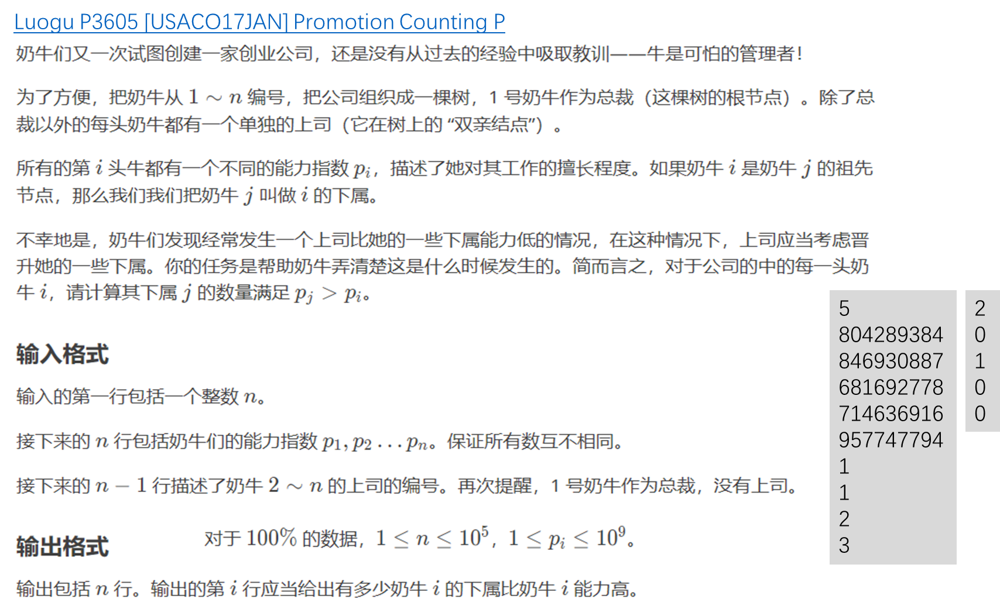
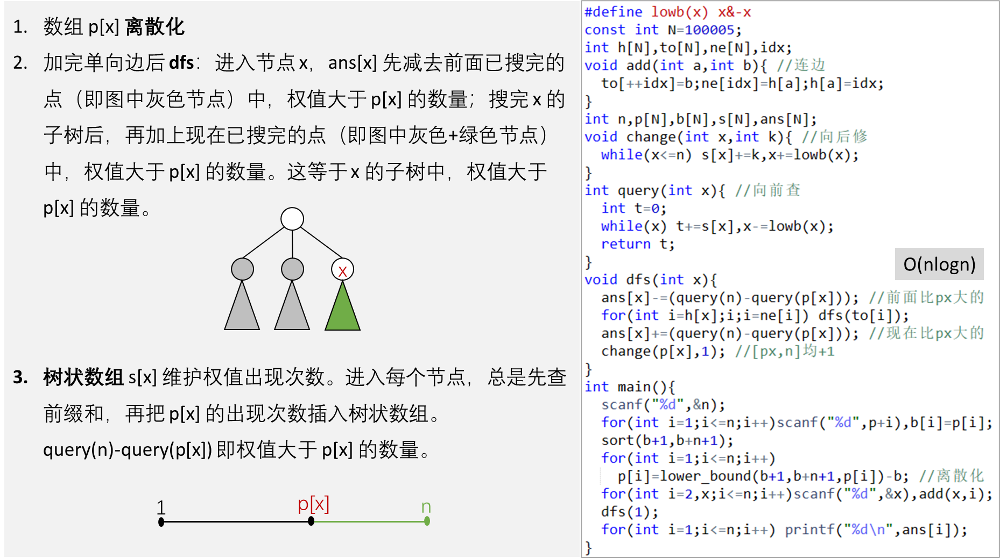

# CSP-S 第十场模拟赛讲评

---
# QSGame-S 模拟赛(10)

难度：橙、黄、绿、蓝。

1. sweet：贪心、分类讨论。
1. robot：贪心、构造。
1. camera：数学、二分。
1. manager：离散化、树状数组、树上DFS。

---

### sweet

#### 题意

给出一个长度为 $n$ 的数组，进行正好 $k$ 次交换使得 $\sum_{i=1}^n \max_{j=1}^ia_j$  最大。

---

#### 分析 

分类讨论，很明显的贪心。

- $k=0$，没有交换次数，从前往后遍历，找前缀最大值 $max(a_j)$ 为每个位置上的贡献。
- $k!=0$ 
    - $n=2$，
        - `2 103`，`30 20`，这种样例中可以发现，与 $k$ 奇偶性有关。
            - $k$ 为奇(如样例)答案就是 $50$，必须 k 次交换使用完。
            - $k$ 为偶，上述样例就是 $60$，也就是 $max_(a_1,a_2) \times 2$。
    - $n!=2$，必处在一种方案，可以将最大值 $a_i$ 交换到开头，答案就是 $max( a_i ) \times n$。

---

#### 参考代码
> 注意开 `long long`，$a_i \le 10^9，n \le 10^5$，`sum` 就会超 `int`。
```cpp
int a[N], t, n, k;
ll _max, sum;
int main() {
    cin >> t;
    while (t--) {
        _max = 0, sum = 0;
        cin >> n >> k;
        for (ll i = 1; i <= n; i++) {
            cin >> a[i];
            if (_max < a[i])
                _max = a[i];
            sum += _max;
        }
        if (k == 0)
            cout << sum << endl;
        else if (n <= 2) {
            if (k & 1)
                cout << a[2] + _max << endl;
            else
                cout << a[1] + _max << endl;
        } else
            cout << _max * n << endl;
    }
}
```

---

### robot

#### ▍题意  

有一个机器人在一个 $n$ 层、每层有 $m$ 个格子的建筑中移动。在第 $x$ 层，机器人可以从上一层的结束位置 $y$ 瞬移到当前层中满足 $|pos - y| \leq k_x$ 的任意位置。每层机器人会踩两个格子，目标是使所有层踩到的两个格子数值之和最小。  

数据范围：$1 \leq n, m \leq 10^5$，$1 \leq k_x \leq m$。

---

#### ▍分析  

通过贪心策略最小化每层踩到的两个格子的数值之和。在第 $x$ 层，机器人可选择的位置数量为：  
$$
\text{len} = \min(m, y + k_x) - \max(1, y - k_x) + 1
$$
由于每层格子数值为 $1$ 到 $m$，要使两个格子之和最小，最优选择是 $1$ 和 $\text{len}$，和为 $\text{len} + 1$。因此问题转化为最小化每层的 $\text{len}$。  

---

关键观察：当机器人在每层的起始位置为第 $1$ 个或第 $m$ 个位置时，$\text{len}$ 最小。通过贪心策略控制机器人位置：  

1. 当前位置为 $1$：能到 $m$ 则到 $m$，否则到 $2$。  
2. 当前位置为 $m$：能到 $1$ 则到 $1$，否则到 $m-1$。  
3. 当前位置为 $2$：能到 $m$ 则到 $m$，否则到 $1$。  
4. 当前位置为 $m-1$：能到 $1$ 则到 $1$，否则到 $m$。 

时间复杂度：$O(n)$，每个层次处理时间为常数。

> 在代码下方，有具体的样例来演示贪心选择的最优解。

---

#### ▍参考代码  

```cpp
int n, m, ans, _nowpos = 1; // _nowpos表示当前所在位置，默认 (1,1) 开始
signed main() {
    cin >> n >> m;
    ans = n; /* 每一行最少的情况是选择 1，共 n 行，初始化选择 n 个 1 */
    for (int i = 1, k; i <= n; i++) {
        cin >> k;
        int _minx = _nowpos - k, _maxx = _nowpos + k;
        _minx = max(_minx, (int)1), _maxx = min(_maxx, m);
        /* 贪心构造出第二个数 */
        int len = (_maxx - _minx + 1); /* 计算最小距离 len */
        ans += len;
        /* 边界效应最大化，移动到端点处，可以一边的区间，使得总区间长度最小 */
        if (len == m) {
            if (_nowpos == m)
                _nowpos = 1;
            else
                _nowpos = m;
        }
        /* 如果到达不了边界，则保持在端点附近，最大化[截断]区间长度 */
        else {
            if (_nowpos == 1)
                _nowpos = 2;
            else if (_nowpos == 2)
                _nowpos = 1;
            else if (_nowpos == m)
                _nowpos = m - 1;
            else if (_nowpos == m - 1)
                _nowpos = m;
        }
    }
    cout << ans << endl;
}
```

---

通过有代表性的例子来展示这个贪心策略的有效性，特别是展示为什么移动到端点或近端点是最优选择。

共有两个样例来演示，每次将位置移动到靠近端点是最好的选择，$nowpos = m$，以及 $nowpos \neq m$ 的情况。

---

## 示例1: $n=3, m=6, k=[2,3,1]$ 

- **初始化**: $now=1, ans=3$
- **第1行** $(k=2)$:
    - $l=max(1,1-2)=1, r=min(6,1+2)=3$
    - l$en=3-1+1=3$
    - $ans=3+3=6$
    - $len<6, now=1→now=2$
---
- **第2行** ($k=3$):
    - $l=max(1,2-3)=1, r=min(6,2+3)=5$
    - $len=5-1+1=5$
    - $ans=6+5=11$
    - $len<6, now=2→now=1$
- **第3行** ($k=1$):
    - $l=max(1,1-1)=1, r=min(6,1+1)=2$
    - $len=2-1+1=2$
    - $ans=11+2=13$
    - $len<6, now=1→now=2$

**总成本: 13**

---

### 对比：如果第 1 行移动到位置 3（非贪心选择）

- **第1行** ($k=2$): $now=1→now=3$
- **第2行** ($k=3$):
    - $l=max(1,3-3)=1, r=min(6,3+3)=6$
    - $len=6-1+1=6$
- **第3行** ($k=1$):
    - $l=max(1,3-1)=2, r=min(6,3+1)=4$
    - $len=4-2+1=3$

**总成本: 3+3+6+3=15 > 13**

这个例子显示，贪心策略通过保持在端点附近，避免了产生全行覆盖的大区间。

---

## 示例2: $n=4, m=5, k=[4,2,3,1]$


- **初始化**: $now=1, ans=4$
- **第1行** ($k=4$):
    - $l=max(1,1-4)=1, r=min(5,1+4)=5$
    - $len=5-1+1=5$
    - $ans=4+5=9$
    - $len=5, now=1→now=5$
- **第2行** ($k=2$):
    - $l=max(1,5-2)=3, r=min(5,5+2)=5$
    - $len=5-3+1=3$
    - $ans=9+3=12$
    - $len<5, now=5→now=4$

---

- **第3行** ($k=3$):
    - $l=max(1,4-3)=1, r=min(5,4+3)=5$
    - $len=5-1+1=5$
    - $ans=12+5=17$
    - $len=5, now=4→now=1$
- **第4行** ($k=1$):
    - $l=max(1,1-1)=1, r=min(5,1+1)=2$
    - $len=2-1+1=2$
    - $ans=17+2=19$

**总成本: 19**

---

### 对比：如果第3行保持在位置4（非贪心选择）

- **第3行** ($k=3$): $now=4→now=4（不移动）$
- **第4行** ($k=1$):
    - $l=max(1,4-1)=3, r=min(5,4+1)=5$
    - $len=5-3+1=3$

**总成本: 4+5+3+5+3=20 > 19**

这个例子显示，贪心策略通过主动移动到端点，为后续行创造了更小的区间长度。

---

### camera

▍题意
给定 $n$ 个监控数据点，每个数据点包含时间 $t_i$ 和位置 $x_i$。有 $m$ 次询问，第 $i$ 次询问包含两个数 $u_i$ 和 $v_i$，表示把原 $t_{u_i}$ 修改为 $v_i$。每次询问后需要输出当前情况下汽车最快时速的最小值（下取整），输出后立即撤销本次修改。

数据范围：$n, m$ 满足 $O((n+m) \log n)$ 时间复杂度可通过。

---

▍分析
汽车最快时速的最小值定义为：对于任意相邻时间点 $t_i$ 和 $t_j$（满足 $t_j > t_i$ 且不存在 $t_k$ 使得 $t_i < t_k < t_j$），计算平均速度 $\frac{|x_j - x_i|}{|t_j - t_i|}$，取所有相邻时间点对中的最大值。

**关键思路**：

1. **排序处理**：首先按时间 $t$ 对监控数据排序

2. **相邻时间点计算**：对于排序后的序列，计算每对相邻时间点的速度贡献值：
    $$
     \left\lfloor\frac{|x_{i+1} - x_i|}{|t_{i+1} - t_i|}\right\rfloor 
    $$
---

3. **带修处理**：

    - 删除操作：预处理前缀最大值和后缀最大值，删除时以删除点为界合并前后段
    - 更新操作：二分查找新时间 $v_i$ 的插入位置，计算与相邻点的新贡献值


时间复杂度：$O((n+m) \log n)$，主要花费在排序和二分查找上。

---

▍参考代码

```cpp
#define int long long

int n, m;           // n: 监控点数量, m: 查询次数
int pre[N], nxt[N]; // 前缀最大值数组和后缀最大值数组
int t[N];           // 存储原始时间值（未排序前）

struct node {
    int x, t; // 位置和时刻
    // 重载小于运算符，按时间排序
    bool operator<(const node &b) const { return t < b.t; }
} p[N]; // 监控点数组

// 计算速度函数：|位置差| / |时间差|
int get(int a, int b, int c, int d) { return abs(a - b) / abs(c - d); }
```
---

```cpp
signed main() {
    ios::sync_with_stdio(false), cin.tie(nullptr);

    cin >> n >> m;
    /* 读取 n 个监控点的位置和时间 */
    for (int i = 1; i <= n; i++) {
        cin >> p[i].x >> p[i].t;
        t[i] = p[i].t; // 保存原始时间值
    }

    // 按时间对监控点排序
    sort(p + 1, p + 1 + n);

    /* 预处理前缀最大值数组 */
    // pre[i] 表示前 i-1 个相邻点对的最大速度
    for (int i = 2; i <= n; i++)
        pre[i] = max(pre[i - 1], get(p[i].x, p[i - 1].x, p[i].t, p[i - 1].t));

    /* 预处理后缀最大值数组 */
    // nxt[i] 表示从 i+1 到 n 的相邻点对的最大速度
    for (int i = n - 1; i >= 1; i--)
        nxt[i] = max(nxt[i + 1], get(p[i].x, p[i + 1].x, p[i].t, p[i + 1].t));
    ...
```
----

```cpp
    while (m--) {
        int u, v; // u: 监控点索引, v: 新的时间值
        cin >> u >> v;

        // 创建临时节点用于查找
        node _tmp;
        _tmp.t = t[u]; // 使用原始时间值

        // 二分查找原始时间在排序后数组中的位置
        int _pos = lower_bound(p + 1, p + 1 + n, _tmp) - p;

        int ans = 0; // 存储当前查询的答案

        /* 考虑删除当前点后的影响 */
        // 1. 左侧部分的最大速度
        if (_pos > 1)
            ans = max(ans, pre[_pos - 1]);

        // 2. 右侧部分的最大速度
        if (_pos < n)
            ans = max(ans, nxt[_pos + 1]);

        // 3. 左右相邻点连接后的速度（跨越删除点）
        if (_pos > 1 && _pos < n)
            ans = max(ans, get(p[_pos - 1].x, p[_pos + 1].x, p[_pos - 1].t,
                               p[_pos + 1].t));
        ...
```
---
```cpp
        /* 考虑插入新时间点后的影响 */
        _tmp.t = v; // 设置新的时间值
        // 二分查找新时间在排序后数组中的位置
        int _npos = lower_bound(p + 1, p + 1 + n, _tmp) - p;

        // 计算新点与后一个点的速度（如果有效）
        if (_npos + 1 != _pos && _npos + 1 > 0 && _npos + 1 <= n)
            ans = max(ans, get(p[_pos].x, p[_npos + 1].x, v, p[_npos + 1].t));

        // 计算新点与前一个点的速度（如果有效）
        if (_npos - 1 != _pos && _npos - 1 > 0 && _npos - 1 <= n)
            ans = max(ans, get(p[_pos].x, p[_npos - 1].x, v, p[_npos - 1].t));

        // 计算新点与当前位置点的速度（如果有效）
        if (_npos != _pos && _npos > 0 && _npos < n)
            ans = max(ans, get(p[_pos].x, p[_npos].x, v, p[_npos].t));

        cout << ans << endl;
    }
    return 0;
}
```

---



---


---

#### 参考代码

```cpp
const int N = 1e5 + 10;
int p[N], b[N], s[N], ans[N];
int n;
vector<int> e[N];
int lowbit(int x) { return x & -x; }
void update(int u, int k) { // 向后修
    while (u <= n) {
        s[u] += k;
        u += lowbit(u);
    }
}
int query(int u) { // 想前查
    int res = 0;
    while (u) {
        res += s[u];
        u -= lowbit(u);
    }
    return res;
}
```
---
```cpp
void dfs(int u) { 
    ans[u] -= (query( n ) - query(p[u])); // 前面比px大的
    for(auto v: e[u])
        dfs( v );
    ans[u] += (query( n ) - query(p[u])); // 前面比px大的
    update( p[u], 1 ); // [px,n] + 1
}
int main() {
    ios::sync_with_stdio(false), cin.tie(nullptr);
    cin >> n;
    for (int i = 1; i <= n; i++)
        cin >> p[i], b[i] = p[i];
    sort(b + 1, b + 1 + n);
    for (int i = 1; i <= n; i++) // 离散到(1~n)
        p[i] = lower_bound(b + 1, b + 1 + n, p[i]) - b;
    for (int i = 2, x; i <= n; i++)
        cin >> x, e[x].emplace_back(i); // x 是 i 的上司
    dfs(1);
    for (int i = 1; i <= n; i++)
        cout << ans[i] << endl;
    return 0;
}
```
