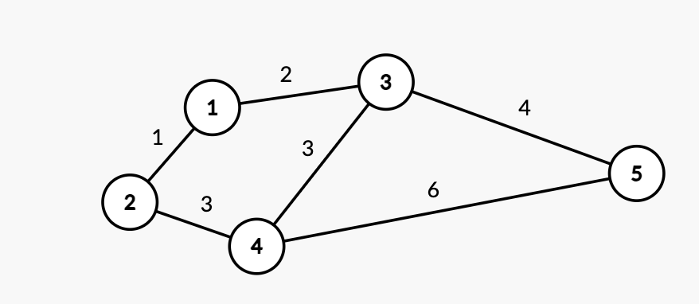

### P4180 [BJWC2010] 严格次小生成树

#### ▍题意

给定一个 $N$ 个点 $M$ 条边的无向图，求其严格次小生成树的边权和。严格次小生成树是指边权和严格大于最小生成树且最小的生成树。

数据范围：$N \le 10^5$，$M \le 3 \times 10^5$，边权 $\in [0,10^9]$。

---

#### 样例的解读
 严格次小生成树：$1 \Rightarrow 2 \Rightarrow 4 \Rightarrow 3 \Rightarrow 5$


#### ▍分析

1. **基本思路**：先求出最小生成树（MST），然后枚举所有非树边，尝试用它替换树中对应路径上的一条边，使得替换后仍然是生成树且权值最小。

2. **关键问题**：为了得到严格次小生成树，被替换的边权必须严格小于新加入的边权。如果路径上的最大边权等于新边权，则需要用严格次大边权来替换。

---


#### ▍正确性证明

 1. **最小生成树性质**：设 $T$ 是 MST，对于任何非树边 $e' = (u, v, w)$，将 $e'$ 加入 $T$ 会形成一个环。根据 MST 的环性质，该环中所有树边的权值都不大于 $w$（否则 $T$ 不是最小）。

 2. **替换策略**：为了构造严格次小生成树，需要从环中删除一条边 $e$，满足 $w(e) < w(e')$，这样新生成树权值 $w(T') = w(T) - w(e) + w(e') > w(T)$。为了最小化 $w(T')$，应选择删除环中严格小于 $w(e')$ 的最大边权 $e$。

---

 3. **严格次大的必要性**：如果环中最大边权等于 $w(e')$，直接替换会导致 $w(T') = w(T)$，不满足严格次小。因此必须使用严格次大边权（即小于 $w(e')$ 的最大边权）进行替换。

 4. **完备性**：任何严格次小生成树 $T'$ 都可以表示为 $T - e + e'$，其中 $e$ 是 $T$ 中边，$e'$ 是非树边。算法枚举所有非树边 $e'$，并找到对应路径上严格小于 $w(e')$ 的最大边权，覆盖所有可能的 $T'$，因此能保证找到最优解。

---

#### 具体实现

- 使用 Kruskal 算法构建 MST，记录总权值 $sum$ 和 MST 中的边
- 在 MST 上进行倍增预处理，维护每个节点的 $2^j$ 级祖先 $f[i][j]$，到该祖先路径上的最大边权 $g[i][j]$ 和严格次大边权 $h[i][j]$
- 对于每条非 MST 边 $(u,v,w)$：
    - 求 $u,v$ 的 LCA
    - 分别查询 $u \to LCA$ 和 $v \to LCA$ 路径上严格小于 $w$ 的最大边权
    - 计算替换后的权值：$sum - max(路径边权) + w$
- 取所有可能替换中的最小值

**时间复杂度**：Kruskal $O(M \log M)$，倍增预处理 $O(N \log N)$，查询 $O(M \log N)$，**总时间复杂度** $O(M \log M + M \log N)$。

---


#### ▍参考代码

```cpp
#define int long long
#define ll long long
const int N = 1e5 + 10, M = 3e5 + 10, F = 40;
const ll INF = (1ll << 62);

struct edge {
    int v, ne, w;
} e[M << 1];
int head[N], tot;
void add(int u, int v, int w) { e[++tot] = {v, head[u], w}, head[u] = tot; }

// 倍增数组: f[i][j]表示i节点的2^j级[祖先]
// g[i][j]表示i节点到2^j级祖先路径上的[最大边权]
// h[i][j]表示i节点到2^j级祖先路径上的[严格次大边权]
int f[N][F], g[N][F], h[N][F], dep[N]; // dep[i]表示节点i的深度

```
---

```cpp
/*
 * DFS预处理倍增数组
   u 当前节点，fa 父节点，w 从父节点到当前节点的边权
*/
void dfs(int u, int fa, int w) {
    dep[u] = dep[fa] + 1;
    // 初始化第一级祖先和边权信息
    f[u][0] = fa, g[u][0] = w, h[u][0] = -INF;

    // 倍增预处理
    for (int i = 1; i <= 20; i++) {
        f[u][i] = f[f[u][i - 1]][i - 1];

        // 最大边权递推
        g[u][i] = max(g[u][i - 1], g[f[u][i - 1]][i - 1]);

        // 次大边权递推: 取两部分的最大值
        h[u][i] = max(h[u][i - 1], h[f[u][i - 1]][i - 1]);

        // 如果两段的最大值不等, 用较小的最大值更新次大值
        if (g[u][i - 1] > g[f[u][i - 1]][i - 1])
            h[u][i] = max(h[u][i], g[f[u][i - 1]][i - 1]);
        else if (g[u][i - 1] < g[f[u][i - 1]][i - 1])
            h[u][i] = max(h[u][i], g[u][i - 1]);
    }

    // dfs处理子节点
    for (int i = head[u]; i; i = e[i].ne) {
        int v = e[i].v, w = e[i].w;
        if (v == fa)
            continue;
        dfs(v, u, w);
    }
}
```
---

```cpp
// 求两个节点的最近公共祖先(LCA)
int lca(int x, int y) {
    if (dep[x] < dep[y])
        swap(x, y);

    for (int i = 20; i >= 0; i--)
        if (dep[f[x][i]] >= dep[y])
            x = f[x][i];

    if (x == y)
        return x;

    for (int i = 20; i >= 0; i--)
        if (f[x][i] != f[y][i])
            x = f[x][i], y = f[y][i];

    return f[x][0];
}

int n, m, fa[N], res, sum; // n,m: 点数和边数, fa: 并查集, sum: MST总权值

struct node {
    int u, v, w;
    // kruskal 按边权升序
    bool operator<(const node &b) const { return w < b.w; }
} a[M << 1];

// 并查集操作
int find(int x) { return x == fa[x] ? x : fa[x] = find(fa[x]); }
void merge(int x, int y) {
    x = find(x), y = find(y);
    if (x == y)
        return;
    fa[x] = y;
}

bool vis[M]; // 标记哪些边在MST中
```
---

```cpp
/**
 * Kruskal算法构建最小生成树(MST)
 * 并建立MST的树结构
 */
void kruskal() {
    cin >> n >> m;
    for (int i = 1; i <= m; i++)
        cin >> a[i].u >> a[i].v >> a[i].w;

    sort(a + 1, a + 1 + m);

    for (int i = 1; i <= n; i++)
        fa[i] = i;

    res = 0;
    // Kruskal算法构建MST
    for (int i = 1; i <= m; i++) {
        int u = a[i].u, v = a[i].v, w = a[i].w;
        int fu = find(u), fv = find(v);

        if (fu != fv) {
            vis[i] = true; // 标记为MST中的边
            res++;         // 已选边数+1
            sum += w;      // 累加MST权值
            merge(u, v);   // 合并连通分量

            // 在MST树中添加双向边
            add(a[i].u, a[i].v, a[i].w), add(a[i].v, a[i].u, a[i].w);
        }

        // 已选出n-1条边, 完成MST构建
        if (res == n - 1)
            break;
    }

    // 在MST上进行DFS预处理
    dfs(1, 0, 0);
}
```
---

```cpp
/**
 * 查询从u到v路径上不等于maxx的最大边权(严格小于maxx的最大值)
 u 起点，v 终点(LCA)，maxx 要排除的边权值(通常是当前边的权值)，路径上严格小于maxx的最大边权
 */
int qmax(int u, int v, int maxx) {
    int ans = -INF;
    // 从u向上跳到v
    for (int i = 20; i >= 0; i--)
        if (dep[f[u][i]] >= dep[v]) {
            // 如果当前段的最大值不等于要排除的值, 用最大值更新答案
            if (maxx != g[u][i])
                ans = max(ans, g[u][i]);
            else // 否则用次大值更新答案
                ans = max(ans, h[u][i]);
            u = f[u][i];
        }
    return ans;
}

void ckmin(int &x, int y) { x = (x < y ? x : y); }
```
---

```cpp
/**
 * 计算严格次小生成树的权值
 * 枚举所有非MST边, 尝试替换MST中路径上的最大边
 */
void calc() {
    int ans = INF; // 次小生成树权值, 初始化为无穷大

    // 遍历所有非MST边
    for (int i = 1; i <= m; i++) {
        if (vis[i])
            continue; // 跳过MST中的边

        int _lca = lca(a[i].u, a[i].v); // 求两端点的LCA

        // 查询两端点到LCA路径上严格小于当前边权的最大边权
        int max_u = qmax(a[i].u, _lca, a[i].w);
        int max_v = qmax(a[i].v, _lca, a[i].w);

        // 计算替换后的权值: MST总权值 - 被替换边权 + 新边权
        // 被替换边权取两段路径中严格小于新边权的最大值
        ckmin(ans, sum - max(max_u, max_v) + a[i].w);
    }

    printf("%lld\n", ans);
}

signed main() {
    ios::sync_with_stdio(false), cin.tie(nullptr);
    kruskal(); // 构建MST
    calc();    // 计算严格次小生成树
    return 0;
}
```

