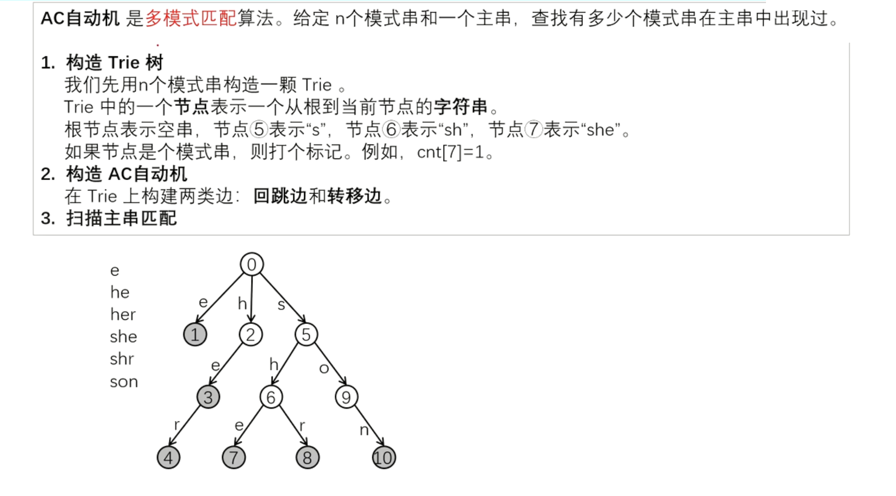
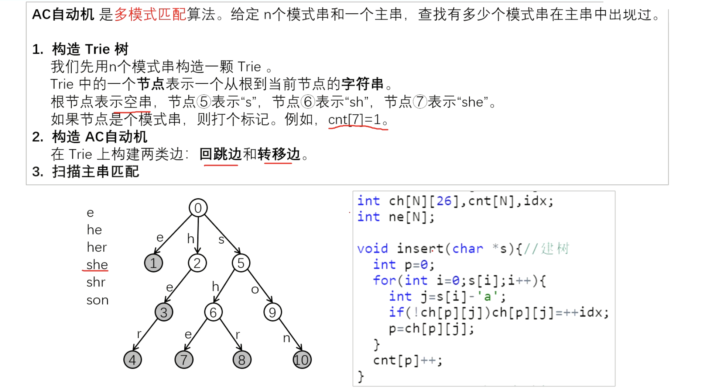
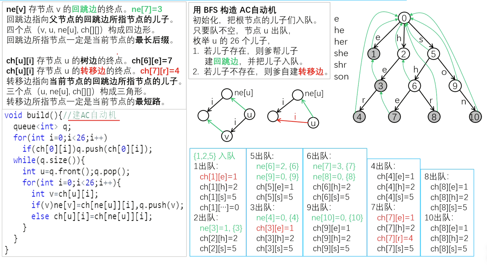
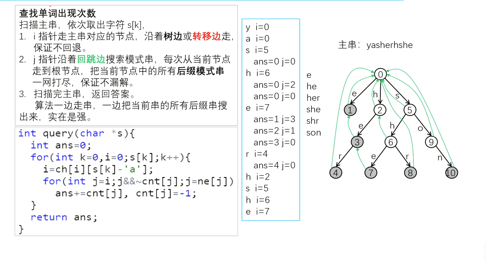
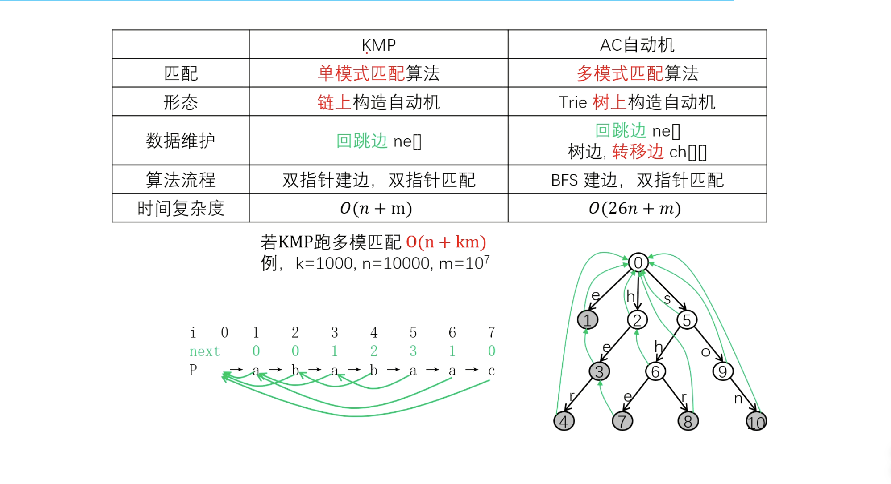
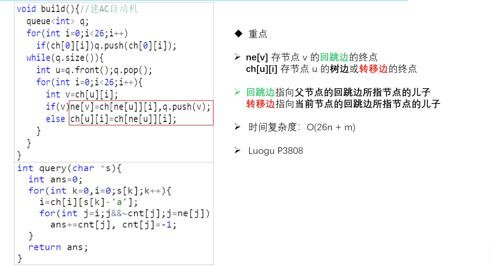

# CSP-S 提高组

## 字符串算法

### ACAM - AC自动机 (Aho-Corasick Automaton)

---

## AC 自动机概述

### 基本概念

**AC 自动机**是多模式匹配算法，用于在文本串中同时查找多个模式串

**核心思想**：

- 结合 $KMP$ 算法的失配指针思想
- 基于 $Trie$ 树结构构建
- 实现高效的多模式匹配

**时间复杂度**：

- 构建：$O(\sum |P_i|)$，其中 $P_i$ 是模式串
- 匹配：$O(|T| + \text{匹配次数})$

---



---


---


---


---


---


---

### P3796 AC 自动机（简单版 II）

▍题意
给定 $N$ 个模式串和一个文本串 $T$，需要找出在文本串中出现次数最多的模式串。如果多个模式串出现次数相同，按输入顺序输出。

数据范围：最多 $50$ 组数据，$1 \leq N \leq 150$，模式串长度 $\leq 70$，文本串长度 $\leq 10^6$。

> 样例解释：第一组数据中，模式串 "aba" 在文本串中出现 4 次，是最多的；第二组数据中，"alpha" 和 "haha" 都出现 2 次，是最多的。

---

▍分析
**核心思路**：使用 AC 自动机高效解决多模式匹配问题。

1. **Trie 树构建**：将所有模式串插入到 Trie 树中，每个叶子节点记录对应的模式串编号。

2. **Fail 指针构建**：通过 BFS 为每个节点构建失败指针，用于在匹配失败时快速跳转。

3. **文本匹配**：在 AC 自动机上遍历文本串，对于每个位置，沿着 fail 链统计所有匹配的模式串。

4. **结果统计**：记录每个模式串的出现次数，按出现次数降序和输入顺序升序排序输出。

**时间复杂度**：$O(\sum |P_i| + |T|)$，其中 $\sum |P_i|$ 是所有模式串总长度，$|T|$ 是文本串长度。

---

▍参考代码
```cpp
const int N = 1e6 + 10;
struct Node {
    int fail;          // 失败指针
    int son[26];       // 子节点
    int end;           // 模式串编号（0表示不是结尾）
} trie[N];

int tot;                // 节点计数器
string patterns[200];   // 存储模式串
int ans[200];           // 每个模式串的出现次数

// 初始化节点
void initNode(int x) {
    memset(trie[x].son, 0, sizeof(trie[x].son));
    trie[x].fail = 0;
    trie[x].end = 0;
}

// 插入模式串到Trie树
void insert(const string& s, int id) {
    int p = 0;
    for (char c : s) {
        int idx = c - 'a';
        if (!trie[p].son[idx]) {
            trie[p].son[idx] = ++tot;
            initNode(tot);
        }
        p = trie[p].son[idx];
    }
    trie[p].end = id;  // 记录模式串编号
}
```
---

```cpp
// 构建AC自动机的fail指针
void build() {
    queue<int> q;
    // 第一层节点的fail指针指向根节点
    for (int i = 0; i < 26; i++) {
        if (trie[0].son[i]) {
            trie[trie[0].son[i]].fail = 0;
            q.push(trie[0].son[i]);
        }
    }
    
    // BFS构建fail指针
    while (!q.empty()) {
        int u = q.front();
        q.pop();
        
        for (int i = 0; i < 26; i++) {
            if (trie[u].son[i]) {
                // 子节点的fail指针指向父节点fail指针的对应子节点
                trie[trie[u].son[i]].fail = trie[trie[u].fail].son[i];
                q.push(trie[u].son[i]);
            } else {
                // 优化：直接记录转移边
                trie[u].son[i] = trie[trie[u].fail].son[i];
            }
        }
    }
}

// 在文本串中查询所有模式串
void query(const string& s) {
    int p = 0;
    for (char c : s) {
        p = trie[p].son[c - 'a'];
        // 沿着fail链统计所有匹配的模式串
        for (int j = p; j; j = trie[j].fail) {
            if (trie[j].end) {
                ans[trie[j].end]++;
            }
        }
    }
}
```

---

```cpp
int main() {
    int n;
    while (cin >> n && n) {
        // 初始化
        tot = 0,initNode(0),memset(ans, 0, sizeof(ans));
        
        // 读取模式串并构建Trie
        for (int i = 1; i <= n; i++) 
            cin >> patterns[i],insert(patterns[i], i);
        
        // 构建AC自动机
        build();
        
        // 读取文本串并查询
        string text;
        cin >> text;
        query(text);
        
        // 找出最大出现次数
        int maxCount = 0;
        for (int i = 1; i <= n; i++) 
            maxCount = max(maxCount, ans[i]);
        
        // 输出结果
        cout << maxCount << "\n";
        for (int i = 1; i <= n; i++) 
            if (ans[i] == maxCount) 
                cout << patterns[i] << "\n";
    }
    
    return 0;
}
```

---

**小结**：

1. **数据结构**：
   - `Node` 结构体表示 Trie 树节点，包含失败指针、子节点数组和模式串编号
   - `patterns` 数组存储所有模式串
   - `ans` 数组记录每个模式串的出现次数

2. **核心函数**：
   - `insert()`：将模式串插入 Trie 树，在结尾节点记录编号
   - `build()`：使用 BFS 构建 fail 指针，优化转移边
   - `query()`：在文本串中匹配所有模式串，沿 fail 链统计出现次数

---

1. **思路**：
   - 初始化 AC 自动机
   - 构建 Trie 树和 fail 指针
   - 在文本串中匹配并统计
   - 输出出现次数最多的模式串

2. **优化技巧**：
   - 转移边优化：避免匹配时频繁跳转 fail 指针
   - 按输入顺序输出：天然满足题目要求

---

## AC 自动机应用：统计模式串出现次数

```cpp
const int N = 1000010;
const int M = 26;

struct Node {
    int son[M], fail, count;
} ac[N];

int idx;
char pattern[N], text[N];

void init() {
    memset(ac, 0, sizeof(ac));
    idx = 0;
}

void insert(const char* s) {
    int p = 0;
    for (int i = 0; s[i]; i++) {
        int c = s[i] - 'a';
        if (!ac[p].son[c]) ac[p].son[c] = ++idx;
        p = ac[p].son[c];
    }
    ac[p].count++;
}

```

---

```cpp
void buildFail() {
    queue<int> q;
    for (int i = 0; i < M; i++) 
        if (ac[0].son[i]) 
            ac[ac[0].son[i]].fail = 0, q.push(ac[0].son[i]);
    
    while (!q.empty()) {
        int u = q.front(); q.pop();
        for (int i = 0; i < M; i++) {
            int v = ac[u].son[i];
            if (v) 
                ac[v].fail = ac[ac[u].fail].son[i],q.push(v);
             else 
                ac[u].son[i] = ac[ac[u].fail].son[i];
        }
    }
}
```
---

```cpp
int query(const char* s) {
    int p = 0, res = 0;
    for (int i = 0; s[i]; i++) {
        int c = s[i] - 'a';
        p = ac[p].son[c];
        for (int j = p; j && ac[j].count != -1; j = ac[j].fail) {
            res += ac[j].count;
            ac[j].count = -1;
        }
    }
    return res;
}
```

---

## AC 自动机优化：记录所有匹配位置

```cpp
// 记录每个模式串的出现位置
vector<int> positions[N];

void queryWithPositions(const char* s) {
    int p = 0;
    for (int i = 0; s[i]; i++) {
        int c = s[i] - 'a';
        p = ac[p].son[c];
        
        for (int j = p; j; j = ac[j].fail) 
            if (ac[j].end) 
                // 记录模式串ac[j].end在位置i出现
                positions[ac[j].end].push_back(i);
    }
}
```

---

## Fail 树的性质

### 重要概念

**Fail 树**：将 $fail$ 指针反向构成的树

**性质**：

- 节点 $u$ 的子树中的所有节点，其 $fail$ 指针路径都会经过 $u$
- 用于统计每个模式串被匹配的次数

```cpp
// 构建fail树
vector<int> fail_tree[N];

void buildFailTree() {
    for (int i = 1; i <= idx; i++) 
        fail_tree[ac[i].fail].push_back(i);
}
```

---

## AC 自动机与动态规划

### 应用场景

在包含禁止模式的文本中计数合法字符串

---

```cpp
// dp[i][j]: 长度为i，在AC自动机节点j的合法方案数
const int MOD = 1000000007;
int dp[1010][N];

int countValidStrings(int n) {
    dp[0][0] = 1;
    
    for (int i = 0; i < n; i++) {
        for (int j = 0; j <= idx; j++) {
            if (dp[i][j] == 0) continue;
            
            for (int k = 0; k < M; k++) {
                int next = ac[j].son[k];
                // 如果next节点不是模式串结尾
                if (ac[next].count == 0) 
                    dp[i + 1][next] = (dp[i + 1][next] + dp[i][j]) % MOD;
            }
        }
    }
    
    int ans = 0;
    for (int j = 0; j <= idx; j++) 
        ans = (ans + dp[n][j]) % MOD;
    return ans;
}

```

---

## 算法复杂度分析

| 操作           | 时间复杂度                      | 空间复杂度                      |
| -------------- | ------------------------------- | ------------------------------- |
| 构建 Trie 树   | $O(\sum P_i)$                 | $O(\sum P_i \times \Sigma)$ |
| 构建 Fail 指针 | $O(\sum P_i \times \Sigma)$ | $O(\sum P_i)$                 |
| 文本匹配       | $O(T + m)$                    | $O(1)$                          |

其中：

- $P_i$：第 $i$ 个模式串
- $T$：文本串
- $m$：匹配次数
- $\Sigma$：字符集大小

