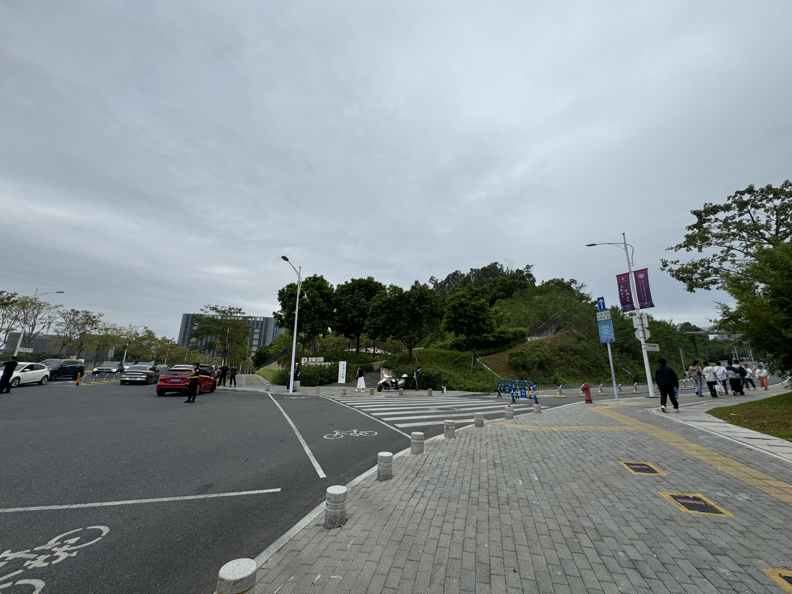
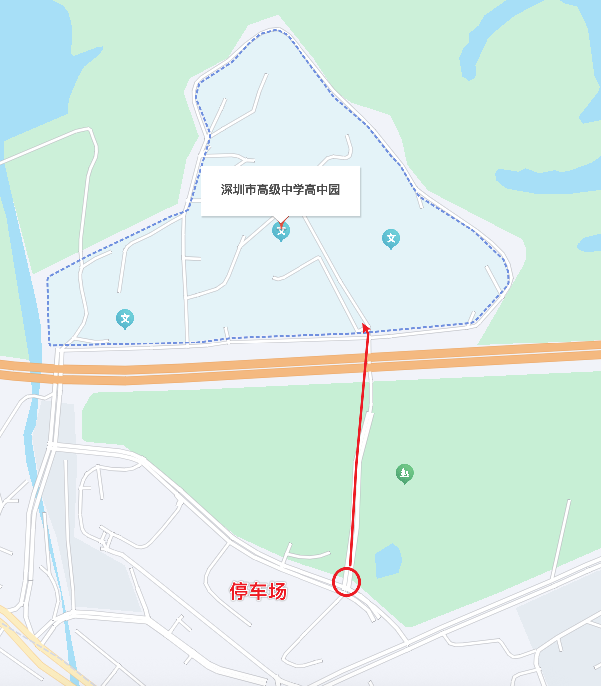
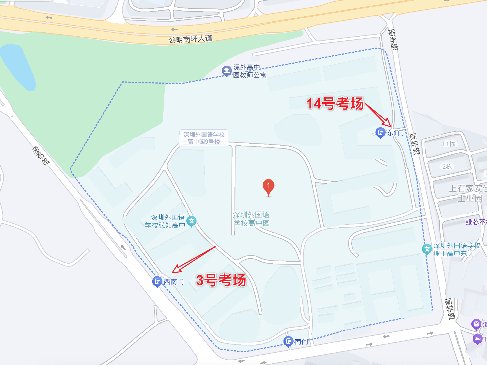
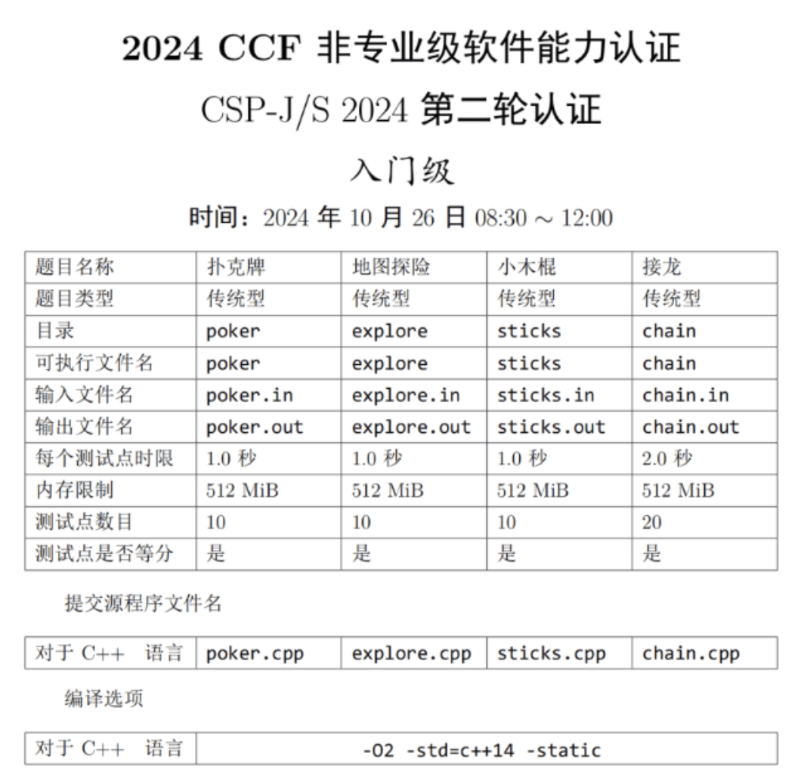
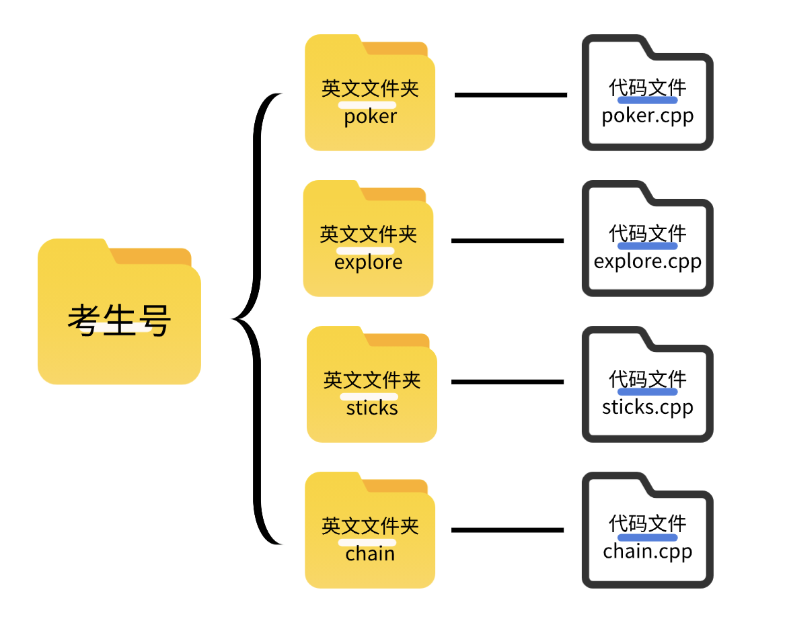

# 2025 CSP-J/S 复赛考前说明会

---
# Content
## 1. 考试地点与送考相关
## 2. 考试注意事项
## 3. 防爆零

---
### 考点 1

**学籍地**：龙岗区，坪山区，盐田区，福田区，罗湖区，大鹏新区，深汕特别合作区

**考试地点**：深圳市高级中学高中园

**具体地址**：深圳市龙岗区坪地街道坪西社区荟英路1号

**建议出行**：学校最近的地铁站为“低碳城”地铁站（3号线），步行距离为1.3公里

**考点服务**：教练与家长可以前往「创新高中」的云舞演艺中心作为休息场所。考试当天中午需要在校就餐的考生及家长，可在午餐时间根据现场指引前往文博高中-「听香苑」付费就餐

---




---


---

### 考点2

**学籍地**：宝安区，龙华区，光明区，南山区

**考试地点**：深圳市外国语高中园

**具体地址**：深圳市光明区马田街道太阳路1008号

**建议出行**：深圳外国语学校高中园位于光明科学城中心，双地铁6号线+13号线站点临近园区。

**特别注意**：$\color{red} 14 号楼考场，从东门进$，$\color{blue} 3 号楼考场，从西门$

**考点服务**：家长及指导老师休息区：大礼堂。位置：在高中园南门进门左前方。餐食：高中园不提供餐食，家长及指导老师如有需求，可点外卖，在大礼堂门厅处临时就餐。为保障休息区卫生，请一定不要在大礼堂就餐，一律在大礼堂门厅处临时就餐，如有违反，通报考生学籍所在校。

---



---

## 送考相关

**前提**：由于人力有限，本次送考仅对考点 1「深圳高级中学高中园」的考生进行送考。

**早上**：（可选 & 建议）由阿泽老师统一带着前往考点，集合时间 6:15-6:30，6:30 从「奇思妙学大运校区」出发，抵达考点「深高级高中园」预计 7:20-7:30，抵达考点后「考生合照」留作纪念，7:45 进入考场考试。

**中午**：手机/手表联系阿泽老师，一起在学校内校内就餐+休息+相关答疑，并提醒下午考试的时间。

**下午**：13:45 进入考场，18:30 考后可以手机/手表练习阿泽老师，统一一起返程。

>ps：手机/手表、复习资料等可以由老师暂时保管，出考场后约定地点取回。
>老师全天都会在考点，自行前往的同学，也可以在考前/考后联系阿泽老师，汇合拍摄一张参赛照片以留作纪念。

---

# 考试注意事项

---

## CSP-J/S 2025第二轮认证时间

2025年11月1日（周六）
- 入门级：08:30-12:00
- 提高级：14:30-18:30

## 需两证进入考场

- 有效证件（身份证 / 临时身份证或护照 / 户口本）
- 准考证（报名系统下载打印）

---
## 能带什么？
携带「笔、橡皮、无存储功能手表」等非电子文具入场 

## 不能带什么？
禁止携带任何电子产品或机器设备入场，手机（关机）、U盘或移动硬盘、键盘、鼠标、闹钟、计算器、书籍、草稿纸及背包等物品必须存放在考场外。

---

## 重要注意事项
1\) 入场时间：开考前50-60分钟可入校（听从各考点的安排与指引），并在指定地点休息候考。无特殊原因，考试结束前不得离场。
2\) 请严格遵守各考点主办校的要求，服从安排。

<span class="red-text"> 不服从安排者，将通报全省和考生所在校，报CCF NOI按扰乱考试秩序处置，同时取消考生及所在校参加广东省内信息学竞赛两年。</span>

3）CSP-J2组（入门级）考生请于7:45分经各考点校验后进入各考场，8:10准时停止进入考点；8:10考生入场完毕。按CCF的规定，考试开始后15分钟（即8:45）迟到考生不得进入考场。

4）CSP-S2组（提高级）考生于13:45分经各考点校验后进入各考场，14:10准时停止进入考点；14:10考生入场完毕。按CCF的规定，考试开始后15分钟（即14:45）迟到考生不得进入考场。

---

# 防爆零相关

---

### 按照 CSP-J/S 规范简历文件夹，否则成绩无效

选手必须严格按照CSP-J/S规范建立文件夹，否则成绩无效。

文件夹名为准考证号，下级子文件夹名称为每道题的英文名，子文件夹内仅包含程序源文件。

---





---
#### 第二轮环境及评测方式

<span class="red-text">本次认证提供Windows和NOI Linux 2.0两种环境</span>

<div class="little_text">
考生需要签署《CSP-J/S 诚信考试及知情同意书》（由考点统一提供）。考生本人已知晓windows系统和NOI Linux 系统的差异，由考生本人选择系统完成比赛，本人代码全部存放在该系统环境下。并且考生本人已知晓CSP-J/S最终评测是在Noi Linux下完成。<div class="red-text" > 编译以虚拟机NOI Linux 2.0下为准，如最终评测产生编译问题，由考生自己负责。若考生因认证环境与评测环境的不同而出现成绩差异提出申诉，广东省组织单位和CCF概不受理。</div>
</div>

### 建议：$\text{Windows} \Rightarrow \text{NOILinux2.0} \Rightarrow \text{Windows}$

1. Windows 上使用 Dev-C++ 来编写代码编译运行。
2. 提前开好虚拟机打开 NOILinx2.0，考试倒数（20min）在 NOILinux2.0 上进行代码编译+运行，比对输入输出的结果是否符合要求。
3. 在 Windows 上提交最终的代码文件。

---

## Linux 常用命令

VSCode 上唤醒当前目录下的控制台：Control(Ctr) + J
编译：`g++ 代码文件.cpp -o 生成可执行文件名 -std=c++14`
运行：`./可执行文件名`
返回上一级目录：`cd ..`  
前往绝对路径/相对路径：`cd xx`  

<span class="red-text">ps：先保存文件，每次修改文件都需要重新「编译+运行」，才会得到新的运行效果。</span>

## 最后的 Linux 系统上机演示

---
## 我能在代码中使用...吗？

- **bits/stdc++.h**：可以使用，但会增大标识符冲突的风险 。

- **__int128**：可以使用，但不能直接使用 cin/cout, scanf/printf 进行输入输出，需要手写输入输出函数 。

---
## 快读快写

```cpp
// 快速读取 _int128
void read_fast(__int128 &x) {
    x = 0;
    char c = getchar();
    bool neg = false;

    // 跳过空白字符
    while (isspace(c))
        c = getchar();

    // 处理符号
    if (c == '-') {
        neg = true;
        c = getchar();
    } else if (c == '+') {
        c = getchar();
    }

    // 读取数字
    while (isdigit(c)) {
        x = x * 10 + (c - '0');
        c = getchar();
    }

    if (neg)
        x = -x;
}


```
---

```cpp
// 快速输出 _int128
void print_fast(__int128 x) {
    if (x == 0) {
        putchar('0');
        return;
    }

    if (x < 0) {
        putchar('-');
        x = -x;
    }

    // 使用栈避免反转
    char buffer[40];
    int pos = 0;

    while (x > 0) {
        buffer[pos++] = '0' + (x % 10);
        x /= 10;
    }

    while (pos > 0) {
        putchar(buffer[--pos]);
    }
}

int main() {
    __int128 a;
    read_fast(a);
    print_fast(a);
}
```
---

- **ios::sync_with_stdio(false)**：可以使用，但关闭流同步后不应混用 C 风格 IO 和 C++ 风格 IO 。推荐在程序最后刷新缓冲区 。
    - 将 `cout<<endl` 换成 `cout << "\n"`。

- **fclose()**：没有必要，程序结束时会自动关闭输入输出 。如果关闭了流同步，在没有刷新缓冲区的情况下应用 fclose()，可能会导致程序没有输出 。

- **__gcd()**：可以使用（因为没有被禁止的操作）。标准库函数 gcd() 在 C++17 标准中被加入 。

- **gets()**：已被弃用，可以使用 fgets() 替代 。

- **在代码中手动开启 -O2 等优化选项**：不可以，评测时只能按照 PDF 首页给出的编译选项编译程序 。

---

- **exit(0)**：与 main() 函数最后 return 0; 效果一致，可以使用 。即使 main() 函数最后不显式写 return 0; ，不影响程序正常退出时返回零值 。

- **auto 类型说明符**：C++11 起可以使用 。

- **随机函数**：没有限制。

---

### 建议&警告篇

1. 最后时刻不要随意修改程序，检查文件流，检查代码是否有没有被注释掉，检查空间，检查输入输出格式，检查文件结构，确保能通过编译和样例。
2. 建议 $Windows \Rightarrow Linux \Rightarrow Windows$ 的写代码和检测的流程。
3. 万能头文件，注意中间的 `bits/std` 斜杆 `/` 不要写反了，在 windows 可以编译通过，但是 Linux 会 CE（编译报错）。
4. 使用 `scanf` 和 `printf` 输入输出时，如果为 `longlong`，一定要用 `%lld`，如果使用 int 的 "%d"，小样例自测不会发生报错和错误，但是 Linux 是 0 分，以上情况反过来也是一样。
5. 使用万能头文件，禁止以 `x0，y0`；禁止使用 `hash` 等 `Linux` 系统关键字为变量名，如果使用 `__int128` 避免使用包括 `abs()` 在内的函数和输入输出函数，建议手写，否则可能在 windows 下可以过编，但是 Linux 下无法过编。
---

6. 如果不用万能头文件，检查是否把需要包含的头文件都包含了。注意使用 `memset` 函数要调用 `<cstring>` 头文件，使用 freopen 进行文件读写需要调用 cstdio 头文件。
7. 建议编译参数加上 `-std=c++14`，以及题面 pdf 给出的其他参数(如`-static`)。
8. 如果 DP 前 `memset` 了数组，转移时最好判一下 `inf` 以防运算的时候爆 `int/long long`。
9.  对拍记得测极小数据和极大数据，极大数据把所有值都要拉满，包括值域。
10. 注意全局变量和局部变量重名，内外层同时定义时可以用 `_a` 调用全局的 `a`。
---

11. 如果平时比较粗心 T1 最好也要写**对拍或手造小样例**。谨慎信任出题人脚造样例。
12. 计算空间使用 `N*(字节数)/1024/1024`，单位 MB。`int` 占 4 个字节，`long long` 占 8 个字节。
13. 大数据范围慎用vector，容易爆空间（极限数据下，vector的空间可能会是普通数组的 2 倍）。
14. 开赛的时候把每道题都先看一遍再做题。一道题如果观察太久建议换下一道题，不要在一道题上浪费过多时间。如果一道题想到了贪心但感觉做法很假建议往 DP 想，如果一道题看起来不可做建议**暴力＋打表**，有时候两题暴力分的总和可能抵得上一题正解。
15. 把每个变量的所有出现位置都检查一遍，注意行为是否符合该变量的预期意义，排除变量打错的可能性（比如 `j` 打成 `i`，街打成 `1`，`m` 打成 `n` ）。
---

16. 多测要清空(这里不点名)。反复使用的数组也要注意清空。
17. 若使用 windows 系统打开样例发现没有正常显示换行，可能为linux 系统换行符不同导致可以使用 DevC++ 打开样例。
18. 注意 STL 的 size 是 unsigned 类型，不要与负数做运算。
19. 不会做的题全部输出 NO/-1/0 可能获得较高分数。
20. 不开 `long long` 一场空！

---


---

# 联系方式

### 李泽勇（阿泽老师）

**手机/微信**：13104819533

**企业微信**： 