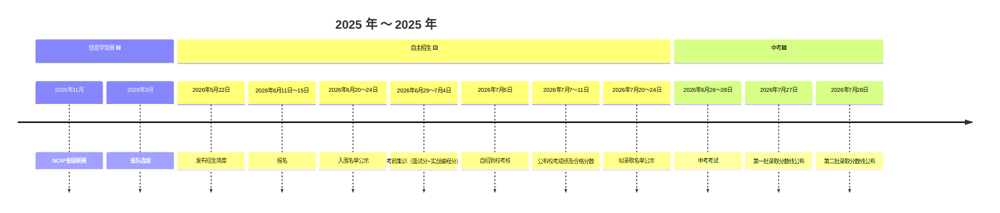

# 2025 年 CSP-S 赛后总结 & 未来规划

### 1. 关于我与我们

我是本班的老师，也是各位的提高组竞赛教练，同时担任着奇思妙学信息学竞赛的负责人。

在这段竞赛生涯里，我们有的在半途相识，也有的，已彼此陪伴着走过了很长一段路。是某种缘分和机遇，让我们在这个班级相聚，一同走上信息学竞赛这条路。

在过去这一年、两年、三年，甚至对于有些同学，是五年之久的时光里，我常常在思考，如何才算一名合格的信竞教练，又该如何保持这颗初心。这不是一个有标准答案的命题，我只能从你们的成长和反馈中，去寻找一些蛛丝马迹，并以此告诉自己，我似乎，还算得上一个不错的教练。

我们一起面对了许多挑战，在不断突破自我的同时，也共同见证了你们在初赛中全班脱颖而出、在复赛中奋力拼搏的每一个点滴。

---

### 2. 信竞学习带来的深远影响

竞赛学习，除了那些可见的成果与成绩，我更看重的，是它带给你们本质上的、内在的成长。

我相信，大多数同学都能感受到信息学竞赛带来的深远收益：

- **良好学习习惯的养成**：课堂专注度的提升、错题总结与反思能力的增强；
- **难题解构思维的锻炼**：学会将复杂问题拆解为小问题，逐步构建解决方案；
- **数学抽象与建模能力的提升**：不仅仅是数字与公式，更是图论等模型的建立，使问题更加立体化，增强数理解题能力；
- **抗挫抗压能力的增强**：面对学习与竞赛的双重压力，学会心理调节，并在成绩不理想时快速恢复信心，重新出发。

---

### 3. 那条我们共同走过的，痛并快乐着的路

“学习信竞是痛并快乐着”——这句话，我想只有真正走过这段路的我们，才能懂得其中的千般滋味。

我们都不会忘记那些“痛”的时刻：
是面对一道难题，苦思冥想数小时，甚至是**为一个BUG调试3～4小时的疲惫**；是代码一次次提交后返回的“WA”（答案错误），带来的挫败与自我怀疑；是牺牲了课余娱乐时间，在机房与书本算法为伴的孤独。

但我们更会永远珍藏那些“快乐”的瞬间：
是某个时刻，灵光乍现，终于找到BUG时的豁然开朗；是按下提交键，屏幕上跳出“AC”（通过）时，那几乎要跳起来的狂喜；是和身边战友为一个思路争得面红耳赤，后又相视一笑的默契；是发现自己能用逻辑和代码，构建出解决复杂问题模型的巨大成就感。

正是这些“痛”，磨砺了我们的心志，让我们的神经变得强韧；正是这些“快乐”，照亮了前行的路，让我们深知所有的付出都无比值得。这条路上滴下的汗与泪，最终都化为了我们骨子里不可分割的力量与荣耀。

---

### 4.阶段性的修正，是为了更高处的相逢

各位同学们，特别是正在初三的你们：

我知道，做出“暂别”的决定并不容易。

从下周开始，直到明年中考，你们或将暂时放下代码和算法，全身心投入另一场至关重要的考试——中考。

请理解，这并非撤退（也并非 AFO），而是一次**战略性的集结**。

你们已经用初赛的晋级和复赛的拼搏，证明了自己在信息学道路上的潜力与坚韧。

现在，我们需要将这份坚韧同样投入到中考的战场。这不是结束，而是一次必要的“上下文切换”，是为了在中考的考场上，同样赢得一个不让未来遗憾的成绩。

我完全理解并坚定地支持你们的决定。请你们也放下任何顾虑，心无旁骛地去冲刺。请相信，我们之间的联结不会因此中断，这只是一次短暂的休整。

**我们早已约定好重逢的坐标：** 就在中考之后，自主招生考试的训练场上，我们将再次集结。届时，我们将无缝衔接，开启更为紧密的暑期提高组备考、NOIP冲刺等一系列高强度的集训。那时的你们，将是卸下了中考重担、更加成熟、目标也更明确的战士。我们将在那时，向着更高的山峰，再次并肩出发。

---

### 5. 我们终将再次并肩

请相信，我们定会在某个时间节点，再次并肩前行。

早些时候我曾说过：“**不要让遗憾，贯穿你的竞赛生涯。**” 而今天，我想对你们说：你们做到了。

什么是遗憾？没有全力以赴地备战与冲刺，才是真正的遗憾。

而你们中的大多数人，都已做到了不留遗憾——这**是一件值得你们骄傲，也令我深感欣慰与自豪的事。**

---

此致

奇思妙学，信竞周日早上提高组班级 全体学生

​																							你们的教练：李泽勇

​																							2025 年 11 月 7 日 于教室