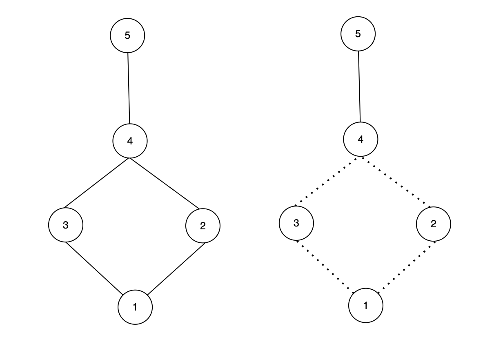

# KMP & Tarjan 训练

---

### P5256 [JSOI2013] 编程作业

#### ▍题意

给定两个字符串 $S$ 和 $T$，其中包含小写字母和大写字母。小写字母要求模式一致，即相同的小写字母在字符串中出现的相对位置必须一致；大写字母则直接匹配。需要计算 $T$ 在 $S$ 中出现的次数，但匹配规则特殊：对于小写字母，匹配时考虑其与上一个相同字母的相对距离；对于大写字母，直接匹配但为避免与小写字母混淆，将其转换为负值。

数据范围：$|S| \leq 10^6$，$|T| \leq 10^5$，测试数据组数 $TT$ 未明确给出，但算法需高效处理。

---


#### ▍分析

算法核心是改进的 KMP 算法。首先对字符串 $S$ 和 $T$ 进行预处理，生成整数数组 $s$ 和 $t$：

- 对于小写字母，计算当前出现位置与上一个相同字母出现位置的距离，即 $s[i] = i - \text{pre}[S[i] - 'a' + 1]$，其中 $\text{pre}$ 数组记录字母的上一次出现位置。
- 对于大写字母，将其转换为负的 ASCII 值，即 $s[i] = -(S[i] - 'A' + 1)$，以避免与小写字母匹配。
同理处理 $T$ 得到数组 $t$。

---

匹配函数 `thesame` 被重写为：
```cpp
bool thesame(int x, int y, int len) { return (x == y) || (y > len && x > len); }
```
该函数表示：如果两个值相等，或者都大于当前匹配长度 $len$（表示都是第一次出现的小写字母），则匹配成功。

在 KMP 算法中，使用 `thesame` 函数来比较字符，从而处理小写字母的模式一致要求。预处理和匹配过程均为线性时间。

---

### 为什么需要`x > len && y > len`？

在字符串匹配中，小写字母代表变量名，变量名可以随意替换，只要模式一致。模式一致意味着：

- 如果两个小写字母在各自字符串的当前匹配段内都是第一次出现，那么它们可以映射到同一个变量名。
- 编码值`x`和`y`表示该字母到上一个相同字母的距离。如果编码值大于`len`，说明上一个相同字母不在当前匹配段内（即当前字母是段内第一次出现）。

因此，`x > len && y > len`确保了两个字母都是当前段内的新变量，从而允许匹配。

---

### 实际样例说明

考虑样例3：

- 完整代码S: `ccddef`
- 代码片段T: `aab`
- 输出: `2`（T在S中出现了两次，分别匹配子串`"ccd"`和`"dde"`）。

首先，对S和T进行编码（编码规则：小写字母编码为到上一个相同字母的距离，如果之前没有出现，则编码为当前索引值）：

---

- T="aab"的编码：
    - 第一个'a'：之前无'a'，编码为1（索引1 - 0）。
    - 第二个'a'：上一个'a'在索引1，编码为1（索引2 - 1）。
    - 第三个'b'：之前无'b'，编码为3（索引3 - 0）。
    - T的编码序列：`[1, 1, 3]`
- S="ccddef"的编码：
    - 第一个'c'：编码为1。
    - 第二个'c'：编码为1。
    - 第三个'd'：编码为3。
    - 第四个'd'：编码为1。
    - 第五个'e'：编码为5。
    - 第六个'f'：编码为6。
    - S的编码序列：`[1, 1, 3, 1, 5, 6]`

---

现在，使用KMP算法匹配T在S中的出现：

1. **第一次匹配**：S的前三个字符`[1, 1, 3]`与T`[1, 1, 3]`逐比较：
    - 比较第一个字符：`x=1`（S）, `y=1`（T）, `len=0`（当前匹配长度）。`x == y`，匹配。
    - 比较第二个字符：`x=1`（S）, `y=1`（T）, `len=1`。`x == y`，匹配。
    - 比较第三个字符：`x=3`（S）, `y=3`（T）, `len=2`。`x == y`，匹配。找到一次匹配。

---

2. **第二次匹配**：S的子串`[3, 1, 5]`（对应索引3-5的字符'd','d','e'）与T`[1, 1, 3]`比较：
    - 比较第一个字符：`x=3`（S）, `y=1`（T）, `len=0`。`x != y`，但`x > len`（3>0）且`y > len`（1>0），所以匹配。
    - 比较第二个字符：`x=1`（S）, `y=1`（T）, `len=1`。`x == y`，匹配。
    - 比较第三个字符：`x=5`（S）, `y=3`（T）, `len=2`。`x != y`，但`x > len`（5>2）且`y > len`（3>2），所以匹配。找到第二次匹配。

在第二次匹配中，尽管编码值不同（如3和1、5和3），但由于都大于当前匹配长度`len`，表示这些字母在当前匹配段内都是第一次出现，因此模式一致，匹配成功。

时间复杂度：预处理 $O(|S| + |T|)$，KMP 匹配 $O(|S| + |T|)$，总时间复杂度为 $O(|S| + |T|)$。

---

#### ▍参考代码

```cpp
const int Slen = 1e6 + 5, Tlen = 1e5 + 5;
int TT, n, m, s[Slen], t[Tlen], pre[30], nxt[Tlen];
char S[Slen], T[Tlen];

bool thesame(int x, int y, int len) {
    return (x == y) || (y > len && x > len);
}

void Kmp() {
    int res = 0;
    memset(nxt, 0, sizeof(nxt));
    nxt[1] = 0;
    for (int i = 2, j = 0; i <= m; i++) {
        while (j && !thesame(t[j + 1], t[i], j)) j = nxt[j];
        if (thesame(t[j + 1], t[i], j)) j++;
        nxt[i] = j;
    }
    for (int i = 1, j = 0; i <= n; i++) {
        while (j && !thesame(t[j + 1], s[i], j)) j = nxt[j];
        if (thesame(t[j + 1], s[i], j)) j++;
        if (j == m) {
            res++;
            j = nxt[j];
        }
    }
    cout << res << "\n";
}
```

---


```cpp
void solve() {
    cin >> (S + 1) >> (T + 1);
    n = strlen(S + 1);
    m = strlen(T + 1);
    memset(pre, 0, sizeof(pre));
    for (int i = 1; i <= n; i++) {
        if (S[i] >= 'A' && S[i] <= 'Z') {
            s[i] = -(S[i] - 'A' + 1);
        } else {
            s[i] = i - pre[S[i] - 'a' + 1];
            pre[S[i] - 'a' + 1] = i;
        }
    }
    memset(pre, 0, sizeof(pre));
    for (int i = 1; i <= m; i++) {
        if (T[i] >= 'A' && T[i] <= 'Z') {
            t[i] = -(T[i] - 'A' + 1);
        } else {
            t[i] = i - pre[T[i] - 'a' + 1];
            pre[T[i] - 'a' + 1] = i;
        }
    }
    Kmp();
}

int main() {
    cin >> TT;
    while (TT--) 
        solve();
    return 0;
}
```


----


### P10953 逃不掉的路
#### ▍题意

给定一个无向连通图，有 $n$ 个城镇和 $m$ 条双向道路。图中任意两个城镇都连通，且至少存在两条不同的路径。对于每个查询 $(a, b)$，需要计算从 $a$ 到 $b$ 的所有路径中必须经过的道路数量（即桥的数量）。

数据范围：$1 \leq n \leq 10^5$，$1 \leq m \leq 2 \times 10^5$，$1 \leq q \leq 10^5$。

---

#### ▍分析

本题需要求两点之间所有路径中的必经之路（桥）。由于图中任意两点都连通且不止一条路，说明图是边双连通分量的集合。必经之路实际上是连接不同边双连通分量的桥。



---

做法：
1. 使用 Tarjan 算法求出所有的边双连通分量，并进行缩点，将原图转化为一棵树（每个边双连通分量对应树的一个节点，桥对应树的边）。
2. 在树上，两点之间的唯一路径上的边数就是必经之路的数量。
3. 使用 LCA（最近公共祖先）算法快速计算树上两点间的距离。

时间复杂度：Tarjan 算法求边双连通分量的时间复杂度为 $O(n + m)$，LCA 预处理的时间复杂度为 $O(n \log n)$，每个查询的时间复杂度为 $O(\log n)$，总时间复杂度为 $O(n + m + q \log n)$。


---

#### ▍参考代码

```cpp
// 双向边
const int N = 1e5 + 10, M = 5e5 + 10;
int n, m, q;
int a, b;

// 链式前向星存储原图
struct edge {
    int v, ne;
};
int h[N], ne[M], to[M], tot = 1; // 判割边，注意建边从 0/2 开始，用于判反边

int low[N], dfn[N], cnt; // low数组, dfn数组, 时间戳计数器
int dotScc[N], dotCnt;   // 点所属的边双连通分量编号, 边双连通分量计数器
int u[M], v[M];          // 存储原始边
int dep[N];              // 在树中的深度
int fa[N][21];           // LCA倍增数组
stack<int> stk;          // Tarjan算法栈

/* 链式前向星加边 */
void add(int u, int v) { to[++tot] = v, ne[tot] = h[u], h[u] = tot; }

// 存储缩点后的树
vector<int> e[N];
```

---

```cpp
/*
 * Tarjan算法求边双连通分量
 * x: 当前节点
 * lastEdge: 上一条边的编号（用于判断反向边）
 */
void tarjan(int x, int lastEdge) {
    low[x] = dfn[x] = ++cnt;
    stk.push(x);

    for (int i = h[x]; i; i = ne[i]) {
        int v = to[i];
        // 如果v未被访问
        if (!dfn[v]) {
            tarjan(v, i);
            low[x] = min(low[x], low[v]);
        }
        // 如果v已被访问且不是反向边（避免重复计算）
        else if (i != (lastEdge ^ 1))
            low[x] = min(low[x], dfn[v]);
    }

    // 发现边双连通分量的根节点
    if (dfn[x] == low[x]) {
        int y;
        dotCnt++; // 新的边双连通分量
        do {
            y = stk.top();
            stk.pop();
            dotScc[y] = dotCnt; // 标记节点属于哪个边双连通分量
        } while (x != y);
    }
}
```

---

```cpp
/*
 * DFS预处理LCA
 * u: 当前节点
 * father: 父节点
 */
void dfs(int u, int father) {
    dep[u] = dep[father] + 1; // 更新深度
    fa[u][0] = father;        // 直接父节点

    // 预处理倍增数组
    for (int i = 1; i <= 20; i++)
        fa[u][i] = fa[fa[u][i - 1]][i - 1];

    // 递归处理子节点
    for (auto v : e[u]) {
        if (v == father)
            continue;
        dfs(v, u);
    }
}
```

---

```cpp
/*
 * LCA算法求最近公共祖先
 * u, v: 需要求LCA的两个节点
 */
int lca(int u, int v) {
    // 确保u的深度不小于v
    if (dep[u] < dep[v])
        swap(u, v);

    // 将u提升到与v同一深度
    for (int j = 20; j >= 0; j--) 
        if (dep[fa[u][j]] >= dep[v]) 
            u = fa[u][j];

    // 如果此时u==v，说明v就是u的祖先
    if (u == v)
        return u;

    // 同时向上跳，直到父节点相同
    for (int j = 20; j >= 0; j--) {
        if (fa[u][j] != fa[v][j]) {
            u = fa[u][j];
            v = fa[v][j];
        }
    }

    // 返回LCA
    return fa[u][0];
}
```
---

```cpp
int main() {
    // 输入原图
    cin >> n >> m;
    for (int i = 1, x, y; i <= m; i++) {
        cin >> u[i] >> v[i];
        add(u[i], v[i]), add(v[i], u[i]); // 添加双向边
    }

    // 对每个连通分量进行Tarjan算法求边双连通分量
    for (int i = 1; i <= n; i++)
        if (!dfn[i])
            tarjan(i, 0);

    // 构建缩点后的树（边双连通分量树）
    for (int i = 1; i <= m; i++) 
        // 如果边的两个端点不在同一个边双连通分量中
        if (dotScc[u[i]] != dotScc[v[i]]) {
            // 在缩点后的树中添加边
            e[dotScc[u[i]]].push_back(dotScc[v[i]]);
            e[dotScc[v[i]]].push_back(dotScc[u[i]]);
        }

    // 在缩点后的树上进行DFS预处理LCA
    dfs(1, 0);

    // 处理查询
    cin >> q;
    while (q--) {
        cin >> a >> b;
        // 计算在缩点树中两个节点之间的距离
        // 距离公式：dep[u] + dep[v] - 2 * dep[lca(u,v)]
        cout << dep[dotScc[a]] + dep[dotScc[b]] -
                    2 * dep[lca(dotScc[a], dotScc[b])]
             << endl;
    }

    return 0;
}
```