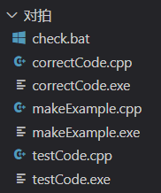

# 对拍

#### 理论  

对拍是广泛运用于 NOI 系列赛事的一种 debug 方式，原理为写一个绝对正确的暴力程序与自己要测试的时间复杂度正确程序进行输出比对。具体过程如下：  

- 由 `makeExample`（构造样例程序）构造出一个符合题目的样例。  
- 传入样例获取到 `testCode`（测试程序）的输出。  
- 传入样例获取到 `correctCode`（正确程序）的输出。  
- 比对输出：  
    - 一样：回到第一步。  
    - 不一样：结束。  

---


#### 写对拍  

1. 创建一个文件夹（名称如 “对拍” ）。  
2. 在文件夹中创建批处理文件（如 `check.bat`），内容如下：  

```bash
makeExample.exe > testCode.in
testCode < testCode.in > testCode.out
correctCode < testCode.in > correctCode.out
fc testCode.out correctCode.out
if errorlevel==1 pause
%0
```

---


**解释**：  

- `makeExample.exe > testCode.in`：生成样例并写入输入文件。  
- `testCode < testCode.in > testCode.out`：运行测试程序并保存输出。  
- `correctCode < testCode.in > correctCode.out`：运行正确程序并保存输出。  
- `fc`：比对两个输出文件。  
- `if errorlevel==1 pause`：如果输出不同则暂停（报错）。  
- `%0`：循环执行。  

3. 创建三个 C++ 文件：  
    - `testCode.cpp`：待测试的代码。  
    - `correctCode.cpp`：暴力正确代码。  
    - `makeExample.cpp`：样例构造代码。  

---

**文件夹结构示例**：  



---

|       名称        |           说明            |
| :---------------: | :-----------------------: |
| `correctCode.cpp` |     暴力/正确代码文件     |
| `makeExample.cpp` |       样例生成文件        |
|  `testCode.cpp`   |       测试代码文件        |
|    `check.bat`    |        批处理脚本         |
|  `testCode.exe`   |   测试程序，可执行文件    |
| `correctCode.exe` | 暴力/正确程序，可执行文件 |
| `makeExample.exe` | 样例生成程序，可执行文件  |

---

#### 查错  

双击 `check.bat` 运行对拍流程。当输出不一致时，程序暂停并显示差异，便于定位错误。  

#### 举例：质因数判断&输出

**题目**：给定 $n$（$1 \leq n \leq 10^6$），输出其 $1 \sim n$ 范围的质数列表。

---

1. **样例构造程序**（`makeExample.cpp`）：  

```cpp
#include <bits/stdc++.h>
using namespace std;
const int MAXN = 1e9;
int main() {
    mt19937 gen(time(nullptr) + random_device{}());
    uniform_int_distribution<> dis(1, MAXN);
    int n = dis(gen);
    cout << n << "\n";
    return 0;
}
```

---

2. **暴力正确代码**（`correctCode.cpp`）：  

```cpp
// 正确代码 --- 暴力的代码
#include <bits/stdc++.h>
using namespace std;
// 输出1~N之间的所有质数

bool check(int x)
{
    if (x < 2)
        return false;
    for (int i = 2; i < x; i++)
        if (x % i == 0)
            return false;
    return true;
}

int main()
{
    int n;
    cin >> n;
    for (int i = 1; i <= n; i++)
        if (check(i))
            cout << i << " ";
    return 0;
}

```

---

3. **错误代码示例**（`testCode.cpp`，用于模拟错误）：  

```cpp
// 当前测试代码 - 埃氏筛法
#include <bits/stdc++.h>
using namespace std;

void solve(int n) {
    vector<bool> vis(n + 1, false); // 使用vector避免VLA，大小n+1
    vis[1] = true; // 1不是质数
    for (int i = 2; i <= n; i++) {
        if (!vis[i]) {
            for (int j = 2 * i; j <= n; j += i)
                vis[j] = true; // 标记合数
        }
    }
    for (int i = 2; i <= n; i++)
        if (!vis[i])
            cout << i << " ";
}

int main() {
    int n;
    cin >> n;
    solve(n);
    return 0;
}
```

---

**对拍效果**：通过随机生成 $n$，对比暴力程序与错误程序的输出，可快速发现错误（如 $n=1$ 时错误程序无输出）。  
