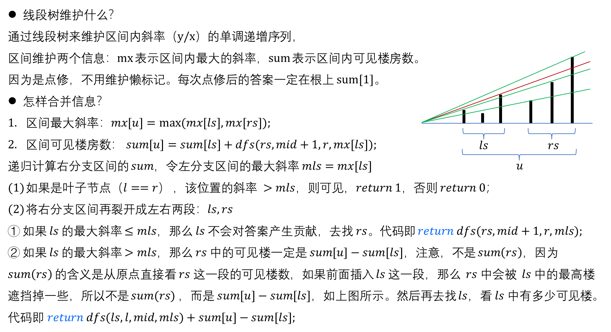

# 奇思妙学 - 2025 NOIP 模拟赛

## 第二场 - 题解报告

难度：绿绿蓝紫

---

### rect

▍题意
给定一个 $n \times m$ 的网格，每个格子可能是 `*`（画过）或 `.`（没画过）。要求计算所有不包含任何画过格子的长方形（只能沿着格子边缘剪）的数量。

数据范围：$1 \leq n, m \leq 1000$。

---

▍分析

**问题分析：**
我们需要统计所有不包含 `*` 的长方形数量。直接枚举所有可能的长方形会达到 $O(n^2m^2)$ 的复杂度，无法通过。

**思路：悬线法**

1. **预处理高度数组：**

    - 定义 $h[i][j]$ 表示从格子 $(i,j)$ 开始向上连续的最大高度（即连续 `.` 的个数）

    - 递推公式：
        $$
        h[i][j] = \begin{cases}
        0 & \text{if } s[i][j] = '*' \\
        h[i+1][j] + 1 & \text{if } s[i][j] = '.'
        \end{cases}
        $$

---

2. **单调栈计算边界：**
    对于每一行 $i$，计算每个位置 $j$ 的左右边界：

    - $l[j]$：向左第一个高度小于 $h[i][j]$ 的位置
    - $r[j]$：向右第一个高度小于等于 $h[i][j]$ 的位置

    使用严格小于和小于等于的组合可以避免重复计数。

---

3. **统计矩形数量：**
    对于位置 $(i,j)$，以 $h[i][j]$ 为高的矩形数量为：
    $$
    \text{count} = h[i][j] \times (r[j] - j) \times (j - l[j])
    $$
    其中：

    - $(r[j] - j)$：向右扩展的选择数
    - $(j - l[j])$：向左扩展的选择数

---

**推导细节：**

考虑以第 $i$ 行为底边的所有矩形。对于每个位置 $(i,j)$，它能向上延伸的最大高度是 $h[i][j]$。

对于固定的高度 $h[i][j]$，我们需要找到左右边界：

- 左边界 $l[j]$：第一个高度小于 $h[i][j]$ 的位置
- 右边界 $r[j]$：第一个高度小于等于 $h[i][j]$ 的位置

---

这样，以 $(i,j)$ 为"中心"的矩形可以：

- 向左扩展到 $l[j]+1$ 到 $j$ 之间的任意位置（共 $j - l[j]$ 种选择）
- 向右扩展到 $j$ 到 $r[j]-1$ 之间的任意位置（共 $r[j] - j$ 种选择）
- 高度可以是 $1$ 到 $h[i][j]$ 之间的任意值（共 $h[i][j]$ 种选择）

因此总贡献为 $h[i][j] \times (r[j] - j) \times (j - l[j])$。

**时间复杂度：**

- 预处理高度数组：$O(nm)$，每行单调栈处理：$O(m)$，总时间复杂度：$O(nm)$

---

▍参考代码

```cpp
#define ll long long
#define endl "\n"

const int N = 1005;
int h[N][N];    // h[i][j]: 从(i,j)向上连续的最大高度
int l[N], r[N], stk[N], top, n, m;
char s[N][N];
ll ans;
```

---

```cpp
/* 处理第row行，计算以该行为底边的矩形数量 */
void solve(int row) {
    top = 0;
    // 计算右边界：向右第一个高度 <= 当前高度的位置
    for (int j = 1; j <= m; j++) {
        while (top && h[row][j] <= h[row][stk[top]])
            r[stk[top]] = j, top--;
        stk[++top] = j;
    }
    // 处理栈中剩余元素（右侧没有更小高度）
    while (top)
        r[stk[top]] = m + 1, top--;
    
    top = 0;
    // 计算左边界：向左第一个高度 < 当前高度的位置
    for (int j = m; j >= 1; j--) {
        while (top && h[row][j] < h[row][stk[top]])
            l[stk[top]] = j, top--;
        stk[++top] = j;
    }
    // 处理栈中剩余元素（左侧没有更小高度）
    while (top)
        l[stk[top]] = 0, top--;
    
    // 统计当前行的矩形数量
    for (int j = 1; j <= m; j++)
        ans += (ll)h[row][j] * (r[j] - j) * (j - l[j]);
}
```

---

```cpp
int main() {
    cin >> n >> m;
    for (int i = 1; i <= n; i++)
        cin >> (s[i] + 1);
    
    // 预处理高度数组（从下往上计算）
    for (int i = n; i >= 1; i--)
        for (int j = 1; j <= m; j++) {
            if (s[i][j] == '*')
                h[i][j] = 0;    // 画过的格子高度为0
            else
                h[i][j] = h[i + 1][j] + 1;  // 没画过的格子继承上一行高度+1
        }
    
    // 处理每一行
    for (int i = 1; i <= n; i++)
        solve(i);
    
    cout << ans << endl;
    return 0;
}
```

---

### lucky

#### ▍题意

给定 $n$ 个奖励条件，每个条件有对应的奖励额度 $w_i$。顾客选择一个幸运数字 $x$，对于每个条件，如果 $x$ 满足条件，则优惠额度异或上 $w_i$。有三种条件类型：

1. 区间型：$L \leq x \leq R$
2. 相等型：$x = A$
3. 不等型：$x \neq B$

求能够得到的最大优惠额度及对应的幸运数字 $x$（如有多个，输出绝对值最小的，如仍有多个，输出值最大的）。


---

#### ▍分析

**问题转化：**
我们需要找到整数 $x$，使得满足某些条件的 $w_i$ 的异或和最大。由于 $n$ 很大，直接枚举所有 $x$ 不可行。

数据范围：$1 \leq n \leq 10^5$，$|L|,|R|,|A|,|B| \leq 10^9$，$1 \leq w_i \leq 10^9$。

---

**思路：差分+离散化**

1. **条件转换：**
    - 区间型 $[L,R]$：在 $L$ 处异或 $w$，在 $R+1$ 处再异或 $w$（差分思想）
    - 相等型 $x=A$：在 $A$ 处异或 $w$，在 $A+1$ 处再异或 $w$
    - 不等型 $x \neq B$：在整个数轴异或 $w$，在 $B$ 处异或 $w$，在 $B+1$ 处再异或 $w$

2. **离散化处理：**
    - 收集所有关键点：条件中的 $L,R,A,B$ 及其相邻点
    - 对关键点排序去重

---

3. **差分操作：**
    - 在离散化后的数组上进行异或操作
    - 通过前缀异或和还原每个位置的异或值


---

**推导：**

**区间型条件分析：**
对于区间 $[L,R]$，我们希望 $x \in [L,R]$ 时异或 $w$。
使用差分思想：在 $L$ 处异或 $w$，在 $R+1$ 处再异或 $w$。
这样，从 $L$ 到 $R$ 的位置都会异或到 $w$，而 $R+1$ 及之后的位置异或两次 $w$ 相当于没有异或。

**相等型条件分析：**
对于 $x = A$，我们希望只有 $x = A$ 时异或 $w$。
在 $A$ 处异或 $w$，在 $A+1$ 处再异或 $w$。
这样只有 $x = A$ 会异或到 $w$。


---

**不等型条件分析：**
对于 $x \neq B$，我们希望除了 $x = B$ 外都异或 $w$。
在整个数轴（从起点）异或 $w$，在 $B$ 处异或 $w$，在 $B+1$ 处再异或 $w$。
这样：

- $x < B$：只异或了一次 $w$
- $x = B$：异或了三次 $w$，相当于异或了一次 $w$
- $x > B$：异或了一次 $w$

**离散化必要性：**
由于坐标范围很大（$10^9$），但关键点只有 $O(n)$ 个，使用离散化将坐标映射到 $1 \sim tot$。

---

**概括步骤：**

1. 收集所有关键点并离散化
2. 在离散化数组上进行差分异或操作
3. 计算前缀异或和得到每个位置的异或值
4. 找最大值及对应的 $x$

**时间复杂度：**

- 离散化：$O(n \log n)$，差分操作：$O(n)$，前缀和计算：$O(n)$，总时间复杂度：$O(n \log n)$

---


#### ▍参考代码

```cpp
const int N = 1e5 + 10;
int l[N], r[N], ans, _anspos, opt[N], n, w[N], pos[N << 2], tot, cnt[N << 2];

int main() {
    cin >> n;
    pos[++tot] = 0; // 加入0点，处理边界情况

    // 收集所有关键点
    for (int i = 1; i <= n; i++) {
        cin >> opt[i];
        if (opt[i] == 1) {
            cin >> l[i] >> r[i] >> w[i];
            // 区间型：需要L, R及其相邻点
            pos[++tot] = l[i],pos[++tot] = l[i] - 1,
			pos[++tot] = r[i],pos[++tot] = r[i] + 1;
        } else {
            cin >> l[i] >> w[i];
            // 相等型/不等型：需要A/B及其相邻点
            pos[++tot] = l[i], pos[++tot] = l[i] + 1, 
			pos[++tot] = l[i] - 1;
        }
    }
```

---

```cpp
    // 离散化
    sort(pos + 1, pos + 1 + tot);
    tot = unique(pos + 1, pos + 1 + tot) - pos - 1;

    // 差分操作
    for (int i = 1; i <= n; i++) {
        // 找到离散化后的位置
        l[i] = lower_bound(pos + 1, pos + 1 + tot, l[i]) - pos;

		// 区间型：[L,R]异或w
        if (opt[i] == 1) {
            r[i] = lower_bound(pos + 1, pos + 1 + tot, r[i]) - pos;
            cnt[l[i]] ^= w[i], cnt[r[i] + 1] ^= w[i];
		// 相等型：只有x=A异或w
        else if (opt[i] == 2)
            cnt[l[i]] ^= w[i], cnt[l[i] + 1] ^= w[i];
		// 不等型：除了x=B都异或w
        else if (opt[i] == 3) {
            cnt[1] ^= w[i];        // 整个数轴异或w
            cnt[l[i]] ^= w[i];     // 在B处再异或w（抵消）
            cnt[l[i] + 1] ^= w[i]; // 在B+1处再异或w（恢复）
        }
    }
```

---

```cpp
    // 计算前缀异或和并找最大值
    ans = cnt[1], _anspos = 1;
    for (int i = 2; i <= tot; i++) {
        cnt[i] ^= cnt[i - 1]; // 前缀异或和

        if (cnt[i] > ans)
            ans = cnt[i], _anspos = i;
        else if (cnt[i] == ans) {
            // 多个解时，选择绝对值最小的，如仍有多个选值最大的
            if (abs(pos[i]) < abs(pos[_anspos])) 
                _anspos = i;
            else if (abs(pos[i]) == abs(pos[_anspos]) && pos[i] > pos[_anspos])
                _anspos = i;
        }
    }

    cout << ans << " " << pos[_anspos] << endl;
    return 0;
}
```

---

### check

#### ▍题意

给定 $Q$ 个询问，每个询问包含两个字符串 $S$ 和 $T$，其中 $S$ 表示完整代码，$T$ 表示代码片段。两个代码段被认为是相同的，当且仅当它们可以通过变量名替换（保持变量名一致性）变得完全相同。要求计算代码片段 $T$ 在完整代码 $S$ 中出现的次数（允许重叠）。

数据范围：$Q \leq 3$，$|T| \leq 10^5$，$|S| \leq 10^6$。

---

#### ▍分析

**问题转化：**
我们需要判断两个代码段是否可以通过变量名替换变得相同。关键观察是：对于变量（小写字母），我们只关心它们的出现模式，而不关心具体的变量名是什么。

**思路：**

1. **变量编码策略：**
    - 对于非变量（大写字母），直接使用负数值编码：$-\text{(字符-'A'+1)}$
    - 对于变量（小写字母），记录该变量上一次出现的位置距离当前位置的距离
    - 如果变量是第一次出现，距离设为当前位置（因为之前没有出现过）

---

2. **匹配条件：**
    两个位置匹配当且仅当：
    - 它们都是非变量且相同，或者
    - 它们都是变量且具有相同的"距离模式"

3. **KMP算法应用：**
    使用改进的KMP算法，在比较字符时使用上述匹配条件

---

**推导细节：**

设字符串 $S$ 和 $T$ 经过编码后分别为数组 $s$ 和 $t$。

对于位置 $i$：

- 如果 $S[i]$ 是大写字母：$s[i] = -(S[i] - 'A' + 1)$
- 如果 $S[i]$ 是小写字母：$s[i] = i - \text{pre}[S[i]-'a'+1]$，其中 $\text{pre}[c]$ 记录字符 $c$ 上一次出现的位置

---

匹配函数 $\text{thesame}(x, y, len)$ 判断两个编码值是否匹配：

- 如果 $x = y$，直接匹配
- 如果 $x > len$ 且 $y > len$，说明两个变量在当前匹配窗口内都是第一次出现，可以匹配

**时间复杂度：**
预处理编码：$O(|S| + |T|)$，KMP匹配：$O(|S| + |T|)$，总时间复杂度：$O(|S| + |T|)$

---

#### ▍参考代码

```cpp
int cnt, n, m, s[N], t[N], pre[30], nxt[N];
string S, T;

/* 判断两个编码值是否匹配
 * x, y: 两个位置的编码值
 * len: 当前已匹配的长度
 * 返回: true如果匹配，false否则
 */
int thesame(int x, int y, int len) { 
    return (x == y) || (x > len && y > len); 
}
```

---

```cpp
/* 改进的KMP算法，使用自定义匹配条件 */
void kmp() {
    int res = 0;
    memset(nxt, 0, sizeof nxt);
    nxt[1] = 0;
    
    // 构建next数组
    for (int i = 2, j = 0; i <= m; i++) {
        while (j && !thesame(t[i], t[j + 1], j))
            j = nxt[j];
        if (thesame(t[i], t[j + 1], j))
            j++;
        nxt[i] = j;
    }
    
    // 进行匹配
    for (int i = 1, j = 0; i <= n; i++) {
        while (j && !thesame(s[i], t[j + 1], j))
            j = nxt[j];
        if (thesame(s[i], t[j + 1], j))
            j++;
        if (j == m) {
            res++;          // 找到匹配
            j = nxt[j];     // 继续寻找重叠匹配
        }
    }
    cout << res << endl;
}
```

---

```cpp
int main() {
    cin >> cnt;
    while (cnt--) {
        cin >> S >> T;
        n = S.size(), m = T.size();
        S = " " + S, T = " " + T;  // 使下标从1开始
        
        // 对完整代码S进行编码
        memset(pre, 0, sizeof pre);
        for (int i = 1; i <= n; i++) 
            // 非变量：使用负数值编码
            if (S[i] >= 'A' && S[i] <= 'Z') 
                s[i] = -(S[i] - 'A' + 1);
            else 
                // 变量：记录与上一次出现的距离
                s[i] = i - pre[S[i] - 'a' + 1], pre[S[i] - 'a' + 1] = i;  // 更新该变量最后出现位置
        
        // 对代码片段T进行编码
        memset(pre, 0, sizeof pre);
        for (int i = 1; i <= m; i++) 
            if (T[i] >= 'A' && T[i] <= 'Z') 
                t[i] = -(T[i] - 'A' + 1);
            else 
                t[i] = i - pre[T[i] - 'a' + 1], pre[T[i] - 'a' + 1] = i;
        kmp();  // 使用KMP算法进行匹配计数
    }
    return 0;
}
```

---


---



---

#### 参考代码

```cpp
#define lc p << 1          // 左子节点索引
#define rc p << 1 | 1      // 右子节点索引
#define mid ((l + r) >> 1) // 区间中点
const int N = 1e5 + 10;
struct node {
    int l, r;
};
int sum[N << 2];          // 区间内可见房子数：递增斜率序列的长度
double maxAscent[N << 2]; // 区间内最大斜率

// ...
int main() {
    int n, m;
    cin >> n >> m;
    for (int i = 1, x, y; i <= m; i++) {
        cin >> x >> y;
        // 更新第x个位置的斜率为y/x
        update(1, 1, n, x, (double)y / x);
        // 根节点的sum就是总的可见楼房数
        cout << sum[1] << endl;
    }
    return 0;
}
```

---

```cpp
// 线段树节点信息合并（向上更新），p 当前节点，l 区间左端点，r 区间右端点
void pushup(int p, int l, int r) {
    // 更新区间最大斜率
    maxAscent[p] = max(maxAscent[lc], maxAscent[rc]);
    // 更新区间可见楼房数 = 左区间可见数 + 右区间中大于左区间最大斜率的楼房数
    sum[p] = sum[lc] + dfs(rc, mid + 1, r, maxAscent[lc]);
}

void update(int p, int l, int r, int x, double k) {
    if (l == r) {
        maxAscent[p] = k, sum[p] = 1; // 单个楼房总是可见（如果斜率>0）
        return;
    }
    if (x <= mid)
        update(lc, l, mid, x, k);
    else
        update(rc, mid + 1, r, x, k);
    pushup(p, l, r);
}
```

---


```cpp
// 在区间 [p] 中查找斜率大于k的可见楼房数量
// p 当前节点索引，l 当前区间左端点，r 当前区间右端点  ，k 比较的斜率阈值
int dfs(int p, int l, int r, double k) {
    // 如果当前区间最大斜率 <= k，整个区间都不可见
    if (maxAscent[p] <= k)
        return 0;

    // 叶子节点：斜率大于k就可见
    if (l == r)
        return maxAscent[p] > k;

    // 如果左区间最大斜率 <= k，只递归右区间
    if (maxAscent[lc] <= k)
        return dfs(rc, mid + 1, r, k);
    else
        // 关键：左区间部分可见，右区间需要重新计算
        // 不能直接使用 sum[rc]，因为右区间可见性受左区间最大斜率影响
        return dfs(lc, l, mid, k) + (sum[p] - sum[lc]);
}
```

---

# 2025 NOIP 第二场模拟赛

## End！


