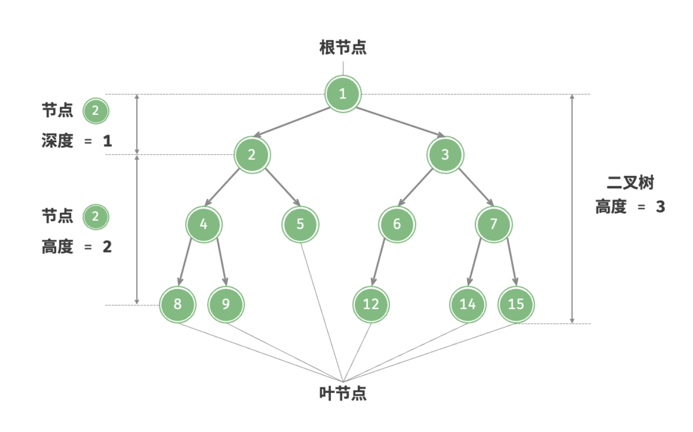
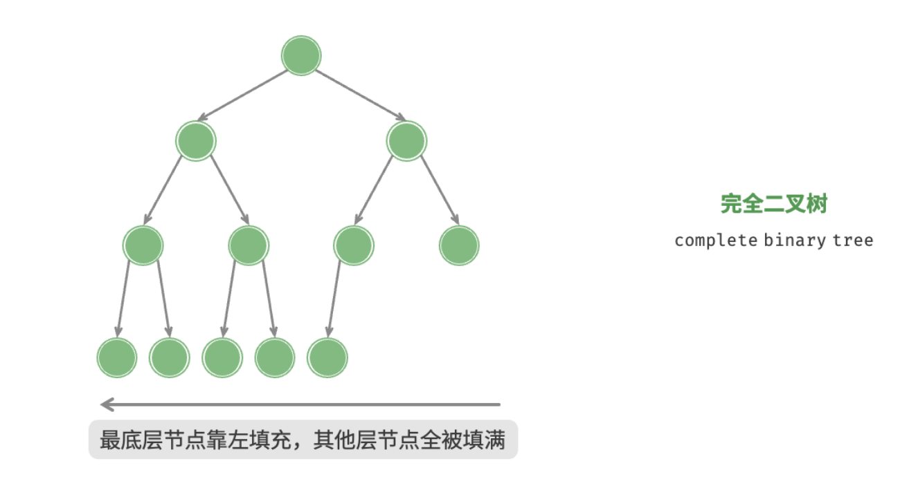
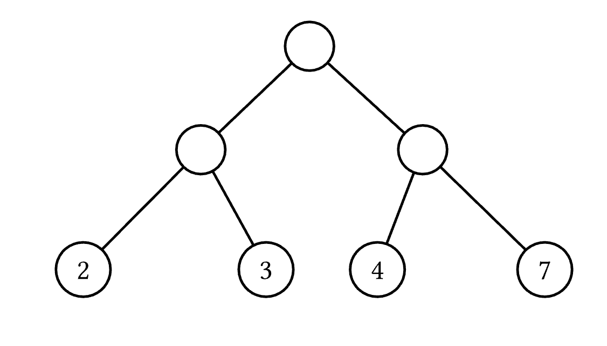
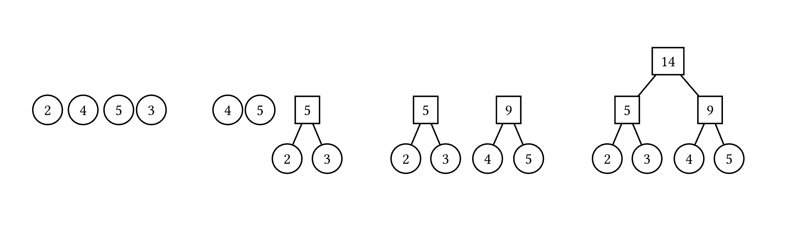
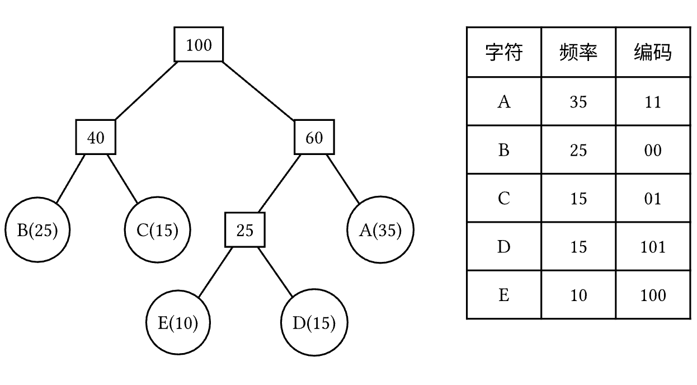
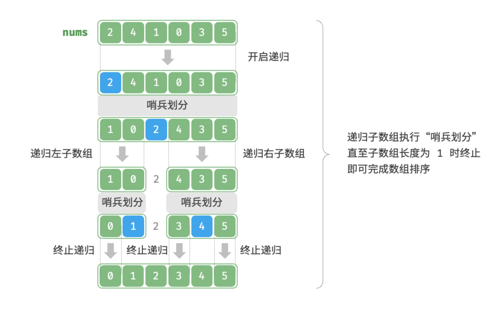

# GESP C++ 六级认证（一）

## 树结构与编码算法

### 哈夫曼树 & 二叉树 & 编码

---

## 大纲

1. **树的基本概念与遍历**
2. **哈夫曼树与编码**
3. **完全二叉树性质**
4. **二叉搜索树**
5. **格雷码与特殊编码**

---

## 树的基本概念

### 树的定义

**树**是由 $n$ ($n \geq 0$) 个节点组成的有限集合：

- 当 $n = 0$ 时，称为空树
- 当 $n > 0$ 时，有且仅有一个根节点
- 其余节点可分为 $m$ ($m \geq 0$) 个互不相交的子树


---



**重要术语**：

- **度**：节点的子树个数
- **叶子节点**：度为 0 的节点
- **分支节点**：度不为 0 的节点
- **深度**：从根到该节点的路径长度
- **高度**：距离当前节点最远的叶节点所经过的边数

---

## 二叉树遍历

### 三种基本遍历方式

**前序遍历**：根 → 左 → 右  
**中序遍历**：左 → 根 → 右  
**后序遍历**：左 → 右 → 根

---

```cpp
struct TreeNode {
    int val;
    int left;
    int right;
    TreeNode(int x) : val(x), left(0), right(0) {}
};
```

---
```cpp
// 前序遍历
void preorder(TreeNode root) {
    if (root.val) return;
    cout << root.val << " ";  // 访问根节点
    preorder(root.left);      // 遍历左子树
    preorder(root.right);     // 遍历右子树
}
// 中序遍历
void preorder(TreeNode root) {
    if (root.val) return;
    preorder(root.left);      // 遍历左子树
    cout << root.val << " ";  // 访问根节点
    preorder(root.right);     // 遍历右子树
}
// 后序遍历
void preorder(TreeNode root) {
    if (root.val) return;
    preorder(root.left);      // 遍历左子树
    preorder(root.right);     // 遍历右子树
    cout << root.val << " ";  // 访问根节点
}
```

---

## 完全二叉树

### 定义与性质

**完全二叉树**：除最后一层外，其他层的节点数都达到最大，且最后一层的节点都集中在左侧。



---

**重要性质**：

1. 具有 $n$ 个节点的完全二叉树深度为 $\lfloor \log_2 n \rfloor + 1$
2. 对于第 $i$ 个节点（从 1 开始编号）：
    - 父节点编号：$\lfloor i/2 \rfloor$
    - 左孩子编号：$2i$
    - 右孩子编号：$2i + 1$

---

12. 在具有2𝑁个结点的完全二叉树中，叶子结点个数为（  ）。 
    A．𝑁 / 2 
    B．𝑁−1
    C．𝑁
    D．𝑁+1 

**GESP样题第12题**：在具有 $2N$ 个结点的完全二叉树中，叶子结点个数为 $N$

---


## 二叉搜索树

### 定义与性质

**二叉搜索树**（BST）满足：

- 左子树所有节点的值 < 根节点的值
- 右子树所有节点的值 > 根节点的值
- 左右子树也都是二叉搜索树

**重要操作**：

- 查找：$O(h)$，最坏 $O(n)$，平均 $O(\log n)$
- 插入：$O(h)$
- 删除：$O(h)$

---

```cpp
// 二叉搜索树查找
TreeNode searchBST(TreeNode root, int val) {
    if (root == nullptr || root.val == val) 
        return root;
    if (val < root.val) 
        return searchBST(root.left, val);
    else 
        return searchBST(root.right, val);
}
```

---


**哈夫曼树**（最优二叉树）：带权路径长度最短的二叉树

**构造过程**：

1. 将所有权值作为单独的树
2. 每次选择权值最小的两棵树合并
3. 新树的权值为两子树权值之和
4. 重复直到只剩一棵树

**带权路径长度**：$WPL = \sum_{i=1}^n w_i \times l_i$

- $w_i$：第 $i$ 个叶子节点的权值
- $l_i$：第 $i$ 个叶子节点的深度

---

## 树的带权路径长度

设二叉树具有 $n$ 个带权叶结点，从根结点到各叶结点的路径长度与相应叶节点权值的乘积之和称为 **树的带权路径长度（Weighted Path Length of Tree，WPL）**。

设 $w_i$ 为二叉树第 $i$ 个叶结点的权值，$l_i$ 为从根结点到第 $i$ 个叶结点的路径长度，则 WPL 计算公式如下：

$$
WPL=\sum_{i=1}^nw_il_i
$$

---



如右图所示，其 WPL 计算过程与结果如下：

$$
WPL=2*2+3*2+4*2+7*2=4+6+8+14=32
$$
---

## 结构

对于给定一组具有确定权值的叶结点，可以构造出不同的二叉树，其中，**WPL 最小的二叉树** 称为 **霍夫曼树（Huffman Tree）**。

对于霍夫曼树来说，其叶结点权值越小，离根越远，叶结点权值越大，离根越近，此外其仅有叶结点的度为 $0$，其他结点度均为 $2$。

---

#### 
## 霍夫曼算法

霍夫曼算法用于构造一棵霍夫曼树，算法步骤如下：

1.  **初始化**：由给定的 $n$ 个权值构造 $n$ 棵只有一个根节点的二叉树，得到一个二叉树集合 $F$。
2.  **选取与合并**：从二叉树集合 $F$ 中选取根节点权值 **最小的两棵** 二叉树分别作为左右子树构造一棵新的二叉树，这棵新二叉树的根节点的权值为其左、右子树根结点的权值和。



---

3.  **删除与加入**：从 $F$ 中删除作为左、右子树的两棵二叉树，并将新建立的二叉树加入到 $F$ 中。
4.  重复 2、3 步，当集合中只剩下一棵二叉树时，这棵二叉树就是霍夫曼树。


---

## 霍夫曼编码

在进行程序设计时，通常给每一个字符标记一个单独的代码来表示一组字符，即 **编码**。

在进行二进制编码时，假设所有的代码都等长，那么表示 $n$ 个不同的字符需要 $\left \lceil \log_2 n \right \rceil$ 位，称为 **等长编码**。

如果每个字符的 **使用频率相等**，那么等长编码无疑是空间效率最高的编码方法，而如果字符出现的频率不同，则可以让频率高的字符采用尽可能短的编码，频率低的字符采用尽可能长的编码，来构造出一种 **不等长编码**，从而获得更好的空间效率。

在设计不等长编码时，要考虑解码的唯一性，如果一组编码中任一编码都不是其他任何一个编码的前缀，那么称这组编码为 **前缀编码**，其保证了编码被解码时的唯一性。

---

霍夫曼树可用于构造 **最短的前缀编码**，即 **霍夫曼编码（Huffman Code）**，其构造步骤如下：

1.  设需要编码的字符集为：$d_1,d_2,\dots,d_n$，他们在字符串中出现的频率为：$w_1,w_2,\dots,w_n$。
2.  以 $d_1,d_2,\dots,d_n$ 作为叶结点，$w_1,w_2,\dots,w_n$ 作为叶结点的权值，构造一棵霍夫曼树。
3.  规定哈夫曼编码树的左分支代表 $0$，右分支代表 $1$，则从根结点到每个叶结点所经过的路径组成的 $0$、$1$ 序列即为该叶结点对应字符的编码。

---




---

#### 计算已有哈夫曼树的 WPL
```cpp
struct HNode {
    int weight;
    int lchild, *rchild;
};

int getWPL(Htree root, int len) { // 递归实现，对于已经建好的霍夫曼树，求 WPL
    if (root == 0)
        return 0;
    else {
        if (root.lchild == 0 && root.rchild == 0) // 叶节点
            return root.weight * len;
        else {
            int left = getWPL(root.lchild, len + 1);
            int right = getWPL(root.rchild, len + 1);
            return left + right;
        }
    }
}
```

---

###
#### 未建立好的哈夫曼树，求 WPL
> 石子合并
```cpp
int getWPL(int arr[], int n) { // 对于未建好的霍夫曼树，直接求其 WPL
    priority_queue<int, vector<int>, greater<int>> huffman; // 小根堆
    for (int i = 0; i < n; i++)
        huffman.push(arr[i]);

    int res = 0;
    for (int i = 0; i < n - 1; i++) {
        int x = huffman.top();
        huffman.pop();
        int y = huffman.top();
        huffman.pop();
        int temp = x + y, res += temp;
        huffman.push(temp);
    }
    return res;
}
```

---
###
#### 给定具体序列，计算哈夫曼编码
```cpp
struct HNode {
    int weight;
    int lchild, int rchild;
};

void huffmanCoding(Htree root, int len, int arr[]) { // 计算霍夫曼编码
    if (root != 0) {
        if (root.lchild == 0 && root.rchild == 0) {
            printf("结点为 %d 的字符的编码为: ", root.weight);
            for (int i = 0; i < len; i++)
                printf("%d", arr[i]);
            printf("\n");
        } else {
            arr[len] = 0;
            huffmanCoding(root.lchild, len + 1, arr);
            arr[len] = 1;
            huffmanCoding(root.rchild, len + 1, arr);
        }
    }
}
```

---

## 格雷码

### 定义与性质

**格雷码**：是一个二进制数系，其中两个相邻数的二进制位只有一位不同。举个例子，$3$ 位二进制数的格雷码序列为

$$
000,001,011,010,110,111,101,100
$$

注意序列的下标我们以 $0$ 为起点，也就是说 $G(0)=000,G(4)=110$。

格雷码由贝尔实验室的 Frank Gray 于 1940 年代提出，并于 1953 年获得专利。

**GESP样题第11题**：011 和 100 不是相邻的格雷码

---

### 生成方法

1. **反射法**：$n$ 位格雷码 = $n-1$ 位格雷码 + 反射的 $n-1$ 位格雷码（最高位补1）
2. **公式法**：$G_i = i \oplus \lfloor i/2 \rfloor$
> 稍后提及证明，如果不想看证明，直接记住公式二即可。

---

### 构造格雷码（变换）手动构造

$k$ 位的格雷码可以通过以下方法构造。我们从全 $0$ 格雷码开始，按照下面策略：

1.  翻转最低位得到下一个格雷码，（例如 $000\to 001$）；
2.  把最右边的 $1$ 的左边的位翻转得到下一个格雷码，（例如 $001\to 011$）；

交替按照上述策略生成 $2^{k-1}$ 次，可得到 $k$ 位的格雷码序列。

---
#### 
### 构造格雷码（变换）镜像构造法

镜像构造法是一种递归方法，用于生成 n 位格雷码序列。其核心思想是：**n 位格雷码可以通过 n-1 位格雷码的镜像反射来构造**。

### 构造步骤

1. **基础情况**：1 位格雷码序列为 `["0", "1"]`
2. **递归步骤**：对于 n 位格雷码（n ≥ 2）：
    - 取 n-1 位格雷码序列
    - **前半部分**：在每个 n-1 位格雷码前加 "0"
    - **后半部分**：将 n-1 位格雷码序列**逆序**，然后在每个代码前加 "1"
    - 将前半部分和后半部分连接起来，得到 n 位格雷码序列

---

#### 
### 逐步构造示例

#### 从 $k=1$ 构造 $k=2$

$k=1$ 序列: $[0, 1]$

前半部分: 加 "0" → [00, 01]
后半部分: 逆序 $[1, 0]$ 后加 "1" → $[11, 10]$

$k=2$ 序列: $[00, 01, 11, 10]$

---
####

#### 从 $k=2$ 构造 $k=3$

$k=2$ 序列: $[00, 01, 11, 10]$

前半部分: 加 "0" → $[000, 001, 011, 010]$
后半部分: 逆序 $[10, 11, 01, 00]$ 后加 "1" → $[110, 111, 101, 100]$

$k=3$ 序列: $[000, 001, 011, 010, 110, 111, 101, 100]$

### 为什么这叫"镜像"构造？

- 后半部分实际上是前半部分的**镜像反射**：顺序相反，且最高位从"0"变为"1"
- 这种构造保证了相邻格雷码只有一位不同，包括首尾相连的部分


---
###

##### 格雷码生成

```cpp
// 生成n位格雷码
vector<string> generateGrayCode(int n) {
    if (n == 1) 
        return {"0", "1"};
    
    // 递归生成n-1位格雷码
    vector<string> prev = generateGrayCode(n - 1);
    vector<string> result;
    
    // 前一半：最高位为0
    for (string code : prev) 
        result.push_back("0" + code);
    
    // 后一半：最高位为1，顺序反转
    for (int i = prev.size() - 1; i >= 0; i--) 
        result.push_back("1" + prev[i]);
    
    return result;
}
// 使用公式生成 n 位格雷码 G(n) = n XOR (n >> 1)
vector<int> generateGrayCodeFormula(int n) {
    int total = 1 << n; // 2^n
    vector<int> grayCodes(total);

    for (int i = 0; i < total; i++) 
        grayCodes[i] = i ^ (i >> 1);
    return grayCodes;
}


```

###

---
####

## 质因子分解

### 空间复杂度分析

**GESP样题第14题**：存储整数 $N$ 的所有质因子的空间复杂度上界

**数学原理**：

- 一个数 $N$ 最多有 $O(\log N)$ 个质因子
- 因为 $2^k \leq N$，所以 $k \leq \log_2 N$

---


**证明**：
设 $N = p_1^{a_1} p_2^{a_2} \dots p_k^{a_k}$，则：

- $2^k \leq p_1 p_2 \dots p_k \leq N$
- $k \leq \log_2 N$

**答案**：$O(\log N)$

---
### 
## 分治算法

### 快速排序的分治思想

**GESP样题第15题**：识别代码中的分治算法思想

**分治三步骤**：

1. **分解**：将原问题分解为子问题
2. **解决**：递归解决子问题
3. **合并**：合并子问题的解



---

```cpp
// 快速排序的分治实现
void quickSort(int arr[], int left, int right) {
    if (left >= right) return;
    
    // 分解：选择基准，划分数组
    int pivot = partition(arr, left, right);
    
    // 解决：递归排序子数组
    quickSort(arr, left, pivot - 1);
    quickSort(arr, pivot + 1, right);
    
    // 合并：原地排序，无需显式合并
}
```

---

####
## 编程题解析

### 下楼梯问题

**问题**：小明下楼梯，每步可以走 1、2 或 3 个台阶，求 $N$ 个台阶的方案数。

**递推关系**：

$f(n) = f(n-1) + f(n-2) + f(n-3)$  

边界条件：$f(0) = 1$, $f(1) = 1$, $f(2) = 2$

---

**动态规划**：

```cpp
long long downstair(int n) {
    if (n == 0) return 1;
    if (n == 1) return 1;
    if (n == 2) return 2;
    
    long long dp[61] = {0};
    dp[0] = 1; dp[1] = 1; dp[2] = 2;
    
    for (int i = 3; i <= n; i++) 
        dp[i] = dp[i-1] + dp[i-2] + dp[i-3];
    return dp[n];
}
```

---
####

## 亲朋数问题

### 子串模运算

**问题**：统计数字串中能被 $p$ 整除的连续子串数量

**数学技巧**：

- 利用模运算的性质：$(a \times 10 + b) \mod p = ((a \mod p) \times 10 + b) \mod p$
- 维护以每个位置结尾的所有子串的模值计数

---


**算法**：

```cpp
long long countDivisibleSubstrings(int p, char S[]) {
    long long count[p];  // 存储当前模值的计数
    for (int i = 0; i < p; i++) count[i] = 0;
    
    long long res = 0;
    int current = 0;
    
    for (int i = 0; S[i] != '\0'; i++) {
        current = (current * 10 + (S[i] - '0')) % p;
        res += count[current];
        count[current]++;
        if (current == 0) res++;  // 当前子串本身可整除
    }
    
    return res;
}
```

---

## 复习要点总结

### 树结构核心概念

1. **二叉树遍历**：前序、中序、后序
2. **完全二叉树**：节点编号规律，叶子节点计算
3. **二叉搜索树**：有序性，查找效率

### 编码算法重点

1. **哈夫曼编码**：最优前缀编码，带权路径最小
2. **格雷码**：相邻码字仅一位不同，反射生成法
3. **质因子分解**：数学性质与复杂度分析

---

### 算法思想

1. **分治算法**：快速排序的典型应用
2. **动态规划**：递推关系的建立与求解
3. **模运算技巧**：子串统计的高效算法
