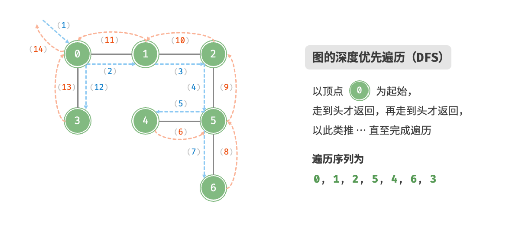
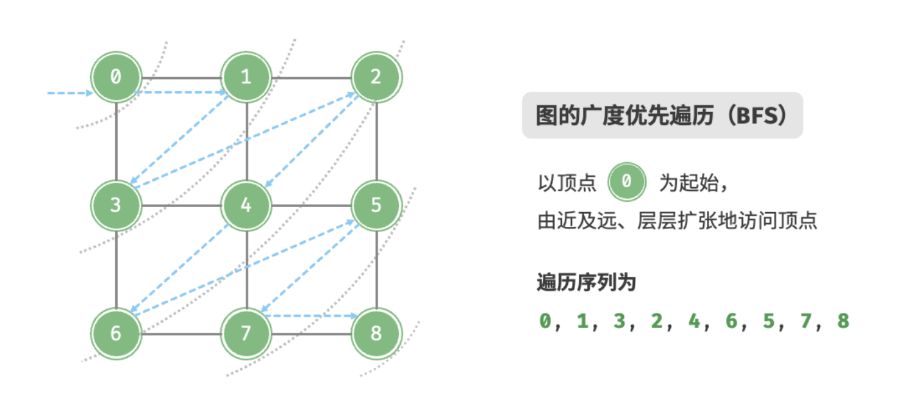
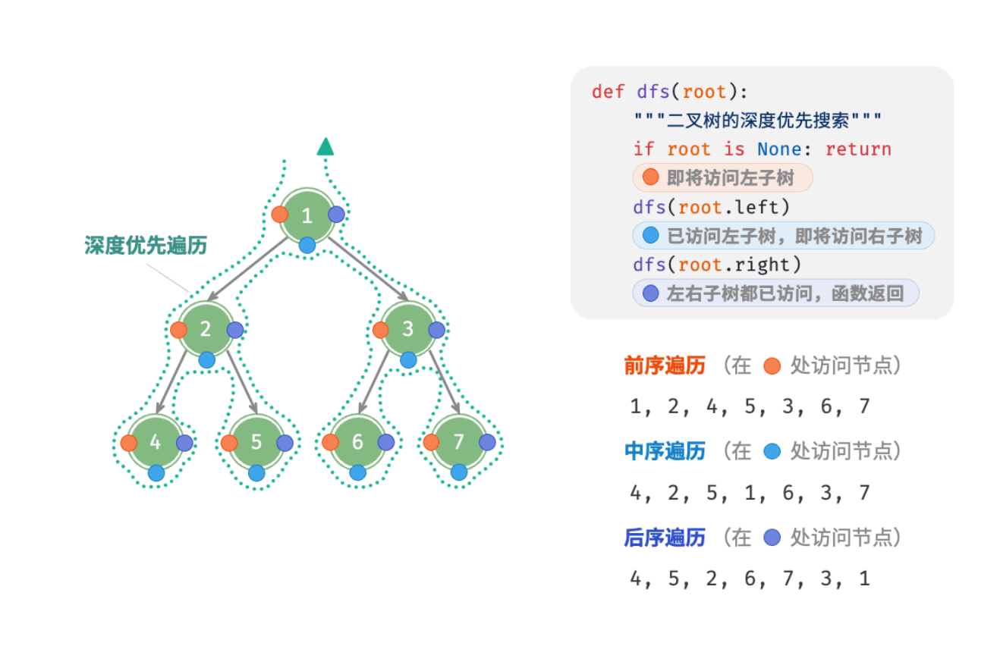

# GESP C++ 六级认证（二）

## 搜索算法专题

### 深度优先搜索 · 广度优先搜索 · 二叉树搜索

---

## 大纲

1. **深度优先搜索（DFS）算法**
2. **广度优先搜索（BFS）算法** 
3. **二叉树的搜索算法**
4. **搜索算法的应用与优化**

---
### 

## 深度优先搜索（DFS）

### 基本思想

**深度优先搜索** 是一种用于遍历或搜索树或图的算法。其核心思想是：

- 从起始节点开始，沿着一条路径尽可能深地搜索
- 直到到达叶子节点或无法继续前进
- 然后回溯到上一个分叉点，选择另一条路径继续搜索

 

---

**特点**：

- 使用栈（递归调用栈或显式栈）实现
- 空间复杂度：$O(h)$，其中 $h$ 为搜索深度
- 不一定找到最短路径

 

---

## DFS 递归实现

```cpp
// DFS 递归实现模板
bool visited[N]; // 标记访问数组

void dfs(int u) {
    visited[u] = true; // 标记当前节点已访问
    // 处理当前节点
    process(u);

    // 遍历所有相邻节点
    for (int v : adj[u])
        if (!visited[v])
            dfs(v); // 递归搜索
}
```

 


---

## DFS 应用：全排列问题

### 问题描述
生成 $1$ 到 $n$ 的所有排列，$n \leq 8$

### 算法思路
- 使用 DFS 递归搜索所有可能的排列
- 维护当前路径和已使用数字的标记
- 当路径长度等于 $n$ 时，输出排列

---
## 
```cpp
int n, path[N]; // 存储当前路径
bool used[N];   // 标记数字是否使用

void dfs(int u) {
    if (u == n) { // 到达叶子节点，输出排列
        for (int i = 0; i < n; i++)
            cout << path[i] << " ";
        cout << endl;
        return;
    }

    for (int i = 1; i <= n; i++) {
        if (!used[i]) {
            path[u] = i;    // 选择当前数字
            used[i] = true; // 标记已使用

            dfs(u + 1); // 递归搜索下一层

            used[i] = false; // 回溯，恢复状态
        }
    }
}

int main() {
    cin >> n;
    dfs(0);
    return 0;
}
```

---

###

## 广度优先搜索（BFS）

### 基本思想

**广度优先搜索** 按层次遍历图或树：

- 从起始节点开始，先访问所有相邻节点
- 然后再访问相邻节点的相邻节点
- 依此类推，层层扩展

 

---

**特点**：
- 使用队列实现
- 空间复杂度：$O(w)$，其中 $w$ 为最大宽度
- 能够找到最短路径（在无权图中）

 

---

### 
## BFS 模板

```cpp
// BFS 模板实现
void bfs(int start) {
    queue<int> q;
    bool visited[N] = {false};
    int dist[N]; // 记录到起点的距离

    // 起点入队并初始数
    q.push(start), visited[start] = true.dist[start] = 0;

    while (!q.empty()) {
        int u = q.front();
        q.pop();

        process(u); // 处理当前节点

        // 遍历所有相邻节点
        for (int v : adj[u])
            if (!visited[v]) {
                visited[v] = true, dist[v] = dist[u] + 1; // 更新距离
                q.push(v);
            }
    }
}

```

 

---

## BFS 应用：迷宫最短路径

### 问题描述
在 $n \times m$ 的迷宫中，从起点 $(sx, sy)$ 到终点 $(ex, ey)$ 的最短路径长度。
障碍物用 `#` 表示，空地用 `.` 表示。

### 算法思路
- 使用 BFS 按层次扩展
- 记录每个位置到起点的距离
- 遇到终点立即返回距离

---
### 
```cpp
int n, m;
char maze[N][N];
int dist[N][N];            // 记录距离
int dx[4] = {-1, 0, 1, 0}, dy[4] = {0, 1, 0, -1}; // 四个方向

int bfs(int sx, int sy, int ex, int ey) {
    queue<pair<int, int>> q;

    for (int i = 0; i < n; i++)
        for (int j = 0; j < m; j++)
            dist[i][j] = -1; // 初始化为-1表示未访问

    q.push({sx, sy});
    dist[sx][sy] = 0;

    while (!q.empty()) {
        auto [x, y] = q.front();
        q.pop();

        if (x == ex && y == ey)
            return dist[x][y]; // 到达终点

        // 遍历四个方向
        for (int i = 0; i < 4; i++) {
            int nx = x + dx[i], ny = y + dy[i];
            // 检查边界和障碍物
            if (nx >= 0 && nx < n && ny >= 0 && ny < m && maze[nx][ny] != '#' &&
                dist[nx][ny] == -1) {
                dist[nx][ny] = dist[x][y] + 1;
                q.push({nx, ny});
            }
        }
    }
    return -1; // 无法到达终点
}
```

---

## 二叉树的搜索算法

### 二叉树遍历方式

二叉树有三种基本遍历方式，都是深度优先搜索的特例：

- **前序遍历**：根 → 左 → 右
- **中序遍历**：左 → 根 → 右  
- **后序遍历**：左 → 右 → 根

**层次遍历**（BFS）：按深度逐层遍历

---

## 二叉树节点定义

```cpp
// 二叉树节点定义
struct TreeNode {
    int val;
    int left;
    int right;
    TreeNode(int x) : val(x), left(0), right(0) {}
};
```

---
### 
## 二叉树 DFS 遍历

```cpp
// 前序遍历
void preorder(TreeNode* root) {
    if (root == 0) return;
    cout << root.val << " ";  // 访问根节点
    preorder(root.left);      // 遍历左子树
    preorder(root.right);     // 遍历右子树
}

// 中序遍历  
void inorder(TreeNode* root) {
    if (root == 0) return;
    inorder(root.left);       // 遍历左子树
    cout << root.val << " ";  // 访问根节点
    inorder(root.right);      // 遍历右子树
}

// 后序遍历
void postorder(TreeNode* root) {
    if (root == 0) return;
    postorder(root.left);     // 遍历左子树
    postorder(root.right);    // 遍历右子树
    cout << root.val << " ";  // 访问根节点
}


```

---
###

## 二叉树 BFS（层次遍历）

```cpp
// 层次遍历（BFS）
void levelOrder(TreeNode root) {
    if (root.val == 0)
        return;

    queue<TreeNode> q;
    q.push(root);

    while (!q.empty()) {
        TreeNode node = q.front();
        q.pop();

        cout << node.val << " "; // 处理当前节点

        // 将子节点加入队列
        if (node.left != 0)
            q.push(node.left);
        if (node.right != 0)
            q.push(node.right);
    }
}


```

---
###

## 二叉搜索树（BST）搜索

### 定义与性质

**二叉搜索树** 满足：
- 左子树所有节点值 < 根节点值
- 右子树所有节点值 > 根节点值  
- 左右子树也都是二叉搜索树

**搜索复杂度**：
- 平均情况：$O(\log n)$
- 最坏情况：$O(n)$（退化成链表）



---
###

## BST 搜索实现

```cpp
// 二叉搜索树查找（递归）
TreeNode searchBST(TreeNode root, int val) {
    if (root.val == 0 || root.val == val)
        return root;

    if (val < root.val)
        return searchBST(root.left, val);
    else
        return searchBST(root.right, val);
}

// 二叉搜索树查找（迭代）
TreeNode searchBST_iterative(TreeNode root, int val) {
    TreeNode curr = root;
    while (curr != 0 && curr.val != val)
        if (val < curr.val)
            curr = curr.left;
        else
            curr = curr.right;
    return curr;
}


```

---
###

## 搜索算法的优化技巧

### 1. 记忆化搜索

在 DFS 中避免重复计算：

```cpp
int memo[N]; // 记忆化数组

int dfs(int u) {
    if (memo[u] != -1)
        return memo[u]; // 直接返回已计算的结果

    int res = 0;
    // ... 计算过程
    memo[u] = res; // 存储结果
    return res;
}
```

---

### 2. 剪枝优化

在搜索过程中提前终止无效分支：

```cpp
void dfs(int u, int current_sum) {
    if (current_sum > target)
        return; // 剪枝：当前和已超过目标

    if (u == n) {
        // 处理结果
        return;
    }

    // 继续搜索...
}
```

---
###


## 典型例题分析

### 例题：岛屿数量

**问题描述**：
给定 $m \times n$ 的二维网格，`'1'` 表示陆地，`'0'` 表示水域，计算岛屿数量。

**算法思路**：
- 使用 DFS 或 BFS 遍历网格
- 遇到 `'1'` 时进行搜索，标记所有相连的陆地
- 每次新的搜索意味着发现一个新岛屿

---
###
```cpp
// DFS 解法
void dfs(vector<vector<char>>& grid, int i, int j) {
    if (i < 0 || i >= grid.size() || j < 0 || j >= grid[0].size() || grid[i][j] != '1')
        return;
    
    grid[i][j] = '0'; // 标记为已访问
    
    // 搜索四个方向
    dfs(grid, i - 1, j),dfs(grid, i + 1, j),dfs(grid, i, j - 1),dfs(grid, i, j + 1);
}

int numIslands(vector<vector<char>>& grid) {
    if (grid.empty()) return 0;
    
    int count = 0;
    for (int i = 0; i < grid.size(); i++) 
        for (int j = 0; j < grid[0].size(); j++) 
            if (grid[i][j] == '1') 
                count++, dfs(grid, i, j);
    return count;
}
```

---

## 搜索算法复杂度分析

### 时间复杂度

- **DFS**：$O(V + E)$，其中 $V$ 是顶点数，$E$ 是边数
- **BFS**：$O(V + E)$
- **二叉树遍历**：$O(n)$，其中 $n$ 是节点数

### 空间复杂度

- **DFS（递归）**：$O(h)$，$h$ 为递归深度
- **DFS（显式栈）**：$O(h)$
- **BFS**：$O(w)$，$w$ 为最大宽度

---

### 

## 技巧总结

### DFS 适用场景
1. 寻找所有可能的解（全排列、组合）
2. 图的连通分量
3. 拓扑排序
4. 检测环


### BFS 适用场景  
1. 最短路径问题（无权图）
2. 层次遍历
3. 扩散问题
4. 最小步数问题

---

## GESP C++ 六级 - 搜索算法

