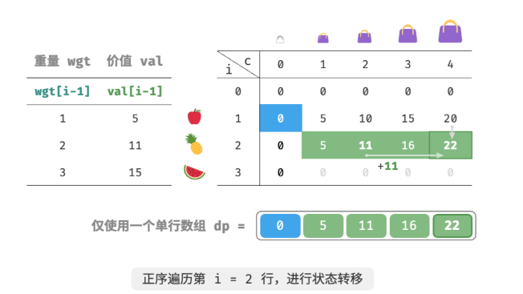

# GESP C++ 六级认证（三）

## 动态规划专题

### 01 背包 · 完全背包 · 可达性背包 · 一维动态规划

---

## 大纲

1. **01 背包问题**
2. **完全背包问题**
3. **可达性背包问题**
4. **一维动态规划**
5. **典型例题分析**

---

## 动态规划基本思想

**动态规划** 是一种通过将原问题分解为相对简单的子问题的方式求解复杂问题的方法。

**核心思想**：

- 最优子结构：问题的最优解包含子问题的最优解
- 重叠子问题：子问题会被重复计算
- 状态转移：通过状态转移方程描述问题结构

---

## 01 背包问题

### 问题描述

有 $n$ 个物品和一个容量为 $V$ 的背包。第 $i$ 个物品的重量是 $w_i$，价值是 $v_i$。每个物品只能选择一次，求在不超过背包容量的前提下能获得的最大价值。

**数据范围**：$1 \leq n \leq 1000$，$1 \leq V \leq 10000$

---

## 01 背包状态定义

定义 $dp[i][j]$ 表示考虑前 $i$ 个物品，背包容量为 $j$ 时的最大价值。

**状态转移方程**：
$$
dp[i][j] = \max(dp[i-1][j], dp[i-1][j-w_i] + v_i)
$$

**边界条件**：
$$
dp[0][j] = 0 \quad (0 \leq j \leq V)
$$


---
###
##### 01 背包一维优化


```cpp
int dp[10010]; // dp[j]：容量为j时的最大价值
int n, V, w[1010], v[1010];

int main() {
    cin >> n >> V;
    for (int i = 1; i <= n; i++)
        cin >> w[i] >> v[i];
    
    // 01背包：逆序枚举容量
    for (int i = 1; i <= n; i++)
        for (int j = V; j >= w[i]; j--)
            dp[j] = max(dp[j], dp[j - w[i]] + v[i]);
    
    cout << dp[V] << endl;
    return 0;
}
```


滚动数组优化空间复杂度：$O(nm) \Rightarrow O(m)$
关键点：容量必须逆序枚举，避免物品被重复选择。


---

## 完全背包问题

### 问题描述

与 01 背包类似，但每个物品可以选择无限次。

**状态转移方程**：
$$
dp[i][j] = \max(dp[i-1][j], dp[i][j-w_i] + v_i)
$$

---

## 完全背包一维实现

```cpp
int dp[10010]; // dp[j]：容量为j时的最大价值
int n, V, w[1010], v[1010];

int main() {
    cin >> n >> V;
    for (int i = 1; i <= n; i++)
        cin >> w[i] >> v[i];
    
    // 完全背包：正序枚举容量
    for (int i = 1; i <= n; i++)
        for (int j = w[i]; j <= V; j++)
            dp[j] = max(dp[j], dp[j - w[i]] + v[i]);
    
    cout << dp[V] << endl;
    return 0;
}
```

**关键点**：容量正序枚举，允许物品被重复选择。



---
##
## 可达性背包问题

### 问题描述

判断能否用给定的物品组合出特定的重量或价值。

**应用场景**：

- 子集和问题
- 硬币找零问题
- 目标值可达性判断

---
## 
```cpp
bool dp[10010]; // dp[j]：容量j是否可达
int n, target, w[1010];

int main() {
    cin >> n >> target;
    for (int i = 1; i <= n; i++)
        cin >> w[i];
    
    dp[0] = true; // 容量0总是可达
    
    // 01背包可达性
    for (int i = 1; i <= n; i++)
        for (int j = target; j >= w[i]; j--)
            if (dp[j - w[i]])
                dp[j] = true;
    
    cout << (dp[target] ? "YES" : "NO") << endl;
    return 0;
}
```

---
###
## 一维动态规划

### 特点与应用

**特点**：

- 状态定义通常为 $dp[i]$ 表示以位置 $i$ 结尾的某种最优值
- 状态转移只依赖于前一个或前几个状态
- 空间复杂度优化为 $O(n)$

**典型问题**：

- 最长上升子序列
- 最大子数组和
- 爬楼梯问题

---

## 最大子数组和问题

### 问题描述

给定一个整数数组 $nums$，找到具有最大和的连续子数组。

**状态定义**：$dp[i]$ 表示以第 $i$ 个元素结尾的最大子数组和。

**状态转移**：
$$
dp[i] = \max(nums[i], dp[i-1] + nums[i])
$$

---

## 

```cpp
int nums[100010], dp[100010], n;
int main() {
    cin >> n;
    for (int i = 1; i <= n; i++)
        cin >> nums[i];
    
    dp[1] = nums[1];
    int ans = dp[1];
    
    for (int i = 2; i <= n; i++) {
        dp[i] = max(nums[i], dp[i-1] + nums[i]);
        ans = max(ans, dp[i]);
    }
    cout << ans << endl;
    return 0;
}
```

**空间优化**：可以只用一个变量记录前一个状态。

---

## 动态规划技巧总结

### 1. 状态设计原则

- 状态应该能够完整描述问题的子结构
- 状态维度要适中，避免维数灾难
- 考虑状态压缩的可能性

### 2. 转移方程推导

- 分析最后一步的选择
- 考虑所有可能的转移
- 验证最优子结构和无后效性

---

## 3. 优化技巧

### 空间优化

- 使用滚动数组
- 降维处理

### 时间优化

- 预处理相关信息
- 利用单调性优化
- 剪枝无效状态

---

## 4. 常见问题类型

| 问题类型 |    特点    |   解决方法   |
| :------: | :--------: | :----------: |
|  01背包  | 物品选一次 | 逆序枚举容量 |
| 完全背包 | 物品选多次 | 正序枚举容量 |
| 分组背包 |  物品分组  |  组内01背包  |
|  树形DP  |   树结构   |   后序遍历   |

---

# 奇思妙学信息学竞赛

## GESP C++ 六级认证（三）

### 动态规划专题

#### 01 背包 · 完全背包 · 可达性背包 · 一维动态规划

